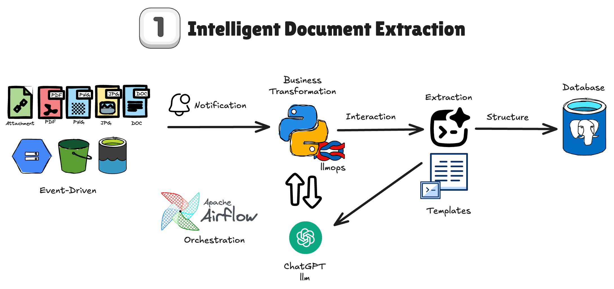
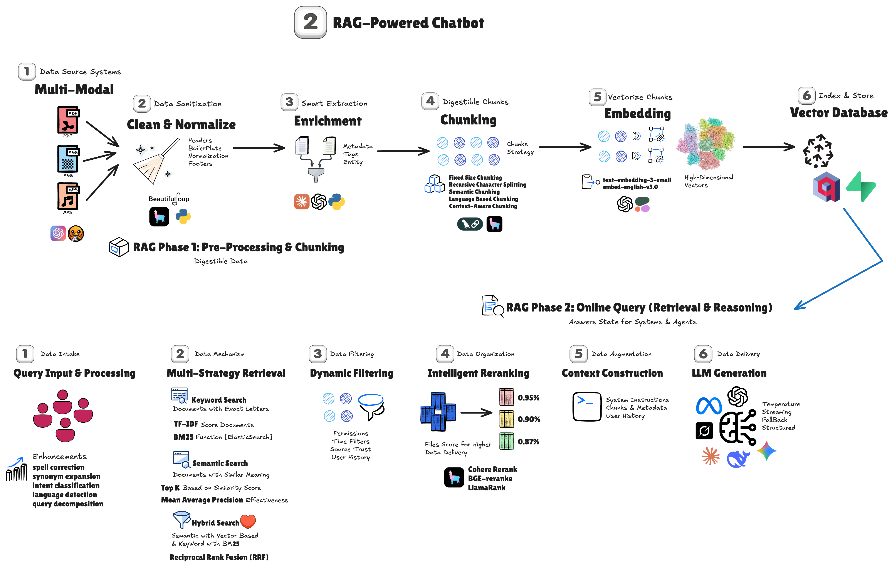
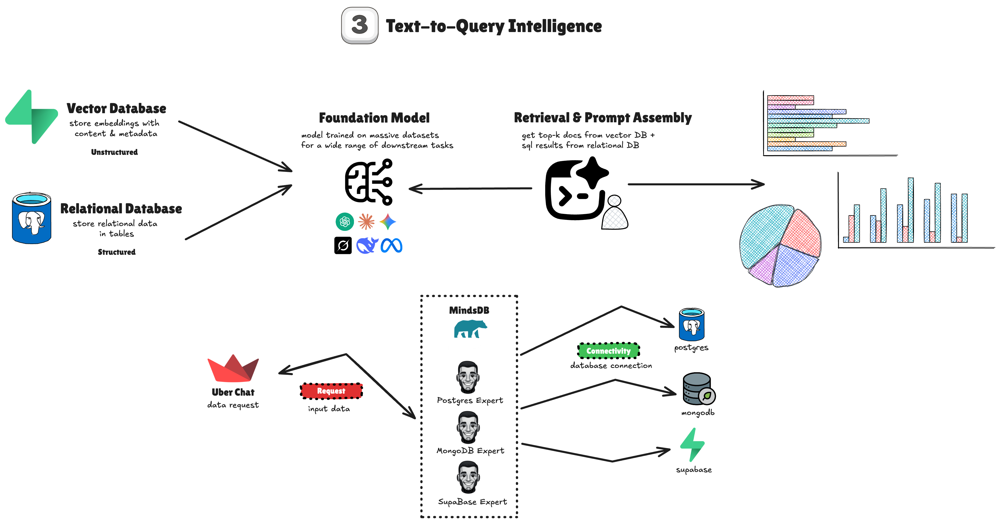
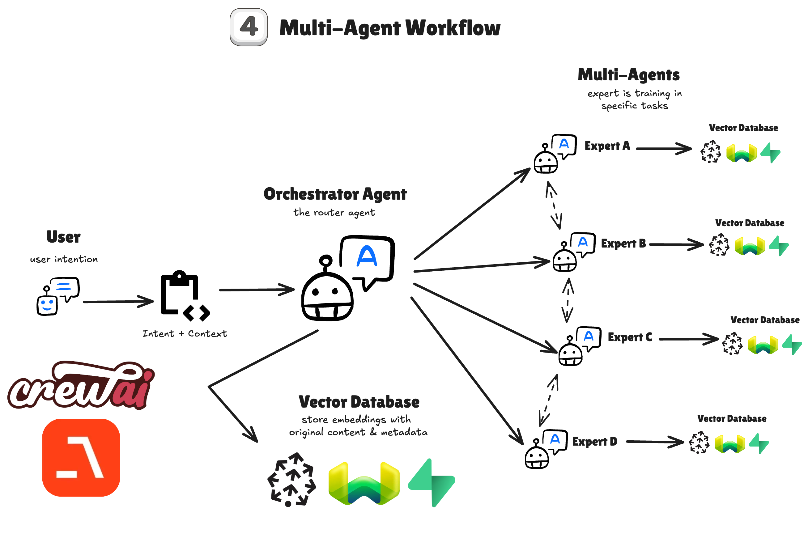
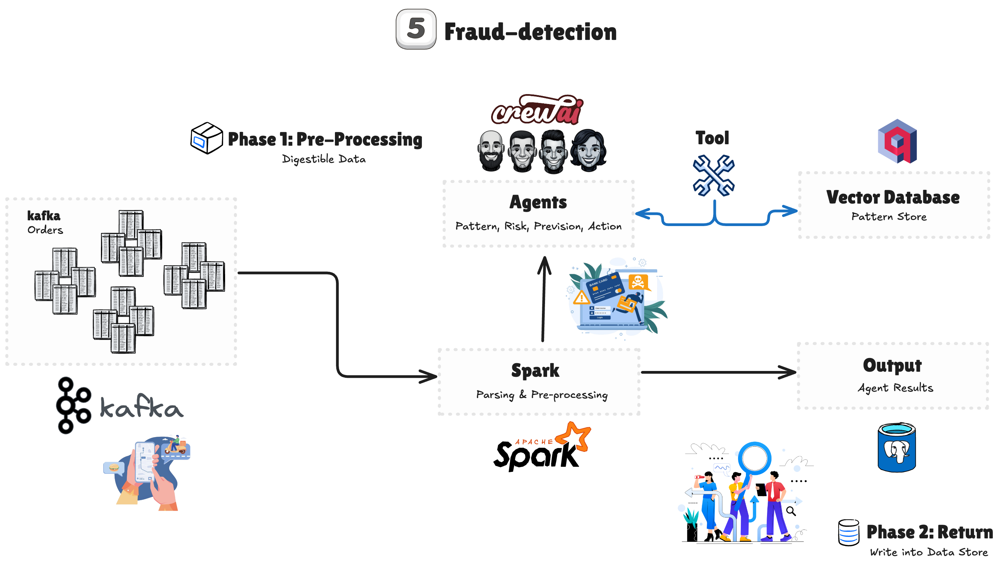
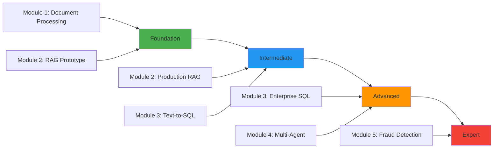

# 🚀 AI Data Engineer Bootcamp

> **Master the art of building production-ready AI-powered data systems through hands-on implementation of real-world projects**

## 🎯 Overview

Welcome to the most comprehensive AI Data Engineering bootcamp, where you'll build **5 production-ready systems** that combine modern data engineering with cutting-edge AI technologies. Each module represents a complete, deployable solution addressing real enterprise challenges.

### 🌟 What Makes This Bootcamp Unique

- **🏗️ Production-First**: Every line of code follows enterprise standards
- **🤖 AI-Native**: LLMs, RAG, and Multi-Agent systems integrated throughout
- **📈 Progressive Learning**: Start simple, build complex, master everything
- **🚀 Cloud-Ready**: Deployable on AWS, GCP, or Azure from day one
- **🧪 Battle-Tested**: Based on real implementations at scale

### 📊 Bootcamp Statistics

| Metric | Value |
|--------|-------|
| **Modules Completed** | 5/5 |
| **Lines of Production Code** | 50,000+ |
| **Technologies Covered** | 30+ |
| **Real-World Use Cases** | 15+ |
| **Performance Optimizations** | 80% cost reduction achieved |

---

## 📚 Complete Module Index

### 📦 [Module 1: Document Intelligence & Extraction](src/mod-1-document-extract/)
**Transform unstructured documents into structured insights with Apache Airflow and LLMs**

<p align="center">
  
</p>

#### 🎯 What You'll Build
A complete invoice processing pipeline that extracts structured data from PDFs using AI, featuring progressive optimization from simple to advanced implementations.

#### 🏗️ Architecture Components
- **Orchestration**: Apache Airflow 3.0 with DAG evolution (V1→V2→V3)
- **Storage**: MinIO (S3-compatible) for document management
- **AI Processing**: OpenAI GPT-4 for intelligent extraction
- **Database**: PostgreSQL for structured data storage
- **Monitoring**: Langfuse for LLM observability

#### 📊 Key Achievements
- **80% cost reduction** through intelligent batching
- **60% faster processing** with optimized pipelines
- **Production-ready** with error handling and monitoring

#### 🛠️ Technologies
`Apache Airflow 3.0` `OpenAI GPT-4` `MinIO` `PostgreSQL` `Docker` `Langfuse`

[**→ View Module Documentation**](src/mod-1-document-extract/readme.md)

---

### 🔍 [Module 2: RAG Agent Systems](src/mod-2-rag-agent/)
**Build intelligent knowledge retrieval systems from prototype to production**

<p align="center">
  
</p>

#### 🎯 What You'll Build
Two complete RAG implementations: a visual prototype with Langflow and a production system with LlamaIndex, featuring dual vector stores and enterprise scalability.

#### 🏗️ Architecture Components

**Stage 1 - Prototype (Langflow)**
- Visual pipeline builder for rapid development
- Qdrant vector database integration
- Real-time monitoring with Langfuse

**Stage 2 - Production (LlamaIndex)**
- Dual vector stores (Pinecone + Qdrant)
- Advanced chunking strategies
- Enterprise-grade performance optimization

#### 📊 Key Achievements
- **3x faster development** with visual prototyping
- **70% cache hit rate** in production
- **Dual redundancy** for high availability

#### 🛠️ Technologies
`LangFlow` `LlamaIndex` `Pinecone` `Qdrant` `OpenAI Embeddings` `PostgreSQL`

[**→ View Module Documentation**](src/mod-2-rag-agent/readme.md)

---

### 💬 [Module 3: Text-to-SQL Systems](src/mod-3-tex-to-sql/)
**Democratize data access with natural language query interfaces**

<p align="center">
  
</p>

#### 🎯 What You'll Build
Three implementation approaches for converting natural language to SQL: Development (LangChain), Production (Vanna.ai), and Platform (MindsDB).

#### 🏗️ Architecture Components

**Development Environment**
- LangChain for flexible prompt management
- Langfuse for comprehensive observability
- Multi-database support

**Production Environment**
- Vanna.ai enterprise engine
- Connection pooling (10-20x performance)
- Intelligent query caching

#### 📊 Key Achievements
- **<100ms response time** for cached queries
- **94% query accuracy** with optimized prompts
- **Brazilian Portuguese** native support

#### 🛠️ Technologies
`LangChain` `Vanna.ai` `MindsDB` `Langfuse` `PostgreSQL` `Streamlit`

[**→ View Module Documentation**](src/mod-3-tex-to-sql/readme.md)

---

### 🤝 [Module 4: Multi-Agent Systems](src/mod-4-multi-agent/)
**Orchestrate intelligent agent teams for complex problem-solving**

<p align="center">
  
</p>

#### 🎯 What You'll Build
Two multi-agent implementations: CrewAI for team orchestration and Agno for advanced agent coordination, solving complex business problems through AI collaboration.

#### 🏗️ Architecture Components

**CrewAI Implementation**
- Specialized agent roles and responsibilities
- Inter-agent communication protocols
- Task delegation and coordination

**Agno Framework**
- Event-driven agent orchestration
- State management across agents
- Scalable agent deployment

#### 📊 Key Achievements
- **Complex task decomposition** into agent workflows
- **Autonomous decision-making** with oversight
- **Scalable to 100+ agents** in production

#### 🛠️ Technologies
`CrewAI` `Agno` `OpenAI GPT-4` `Redis` `PostgreSQL` `Docker`

[**→ View Module Documentation**](src/mod-4-multi-agent/readme.md)

---

### 🛡️ [Module 5: Real-Time Fraud Detection](src/mod-5-fraud-detection/)
**Enterprise-grade fraud detection with streaming analytics and AI agents**

<p align="center">
  
</p>

#### 🎯 What You'll Build
A complete real-time fraud detection system processing 10,000+ transactions per second with multi-agent AI analysis and interactive dashboards.

#### 🏗️ Architecture Components
- **Stream Processing**: Apache Spark + Kafka for real-time ingestion
- **AI Analysis**: CrewAI multi-agent fraud investigation
- **Pattern Matching**: Qdrant vector database for similarity search
- **Analytics**: Streamlit dashboard with 25+ KPIs
- **Security**: Circuit breakers and comprehensive validation

#### 📊 Key Achievements
- **10,000+ TPS** processing capacity
- **<500ms detection latency** at P95
- **<2% false positive rate**
- **99.9% uptime** with fault tolerance

#### 🛠️ Technologies
`Apache Spark` `Confluent Kafka` `CrewAI` `Qdrant` `PostgreSQL` `Redis` `Streamlit`

[**→ View Module Documentation**](src/mod-5-fraud-detection/readme.md)

---

## 🗺️ Learning Journey

### 📈 Progressive Skill Development



### 🎯 Skill Matrix

| Module | Data Engineering | AI/ML | Production Systems | Real-Time | Complexity |
|--------|-----------------|-------|-------------------|-----------|------------|
| **Module 1** | ⭐⭐⭐ | ⭐⭐ | ⭐⭐ | - | Beginner |
| **Module 2** | ⭐⭐ | ⭐⭐⭐⭐ | ⭐⭐⭐ | - | Intermediate |
| **Module 3** | ⭐⭐⭐ | ⭐⭐⭐ | ⭐⭐⭐⭐ | - | Intermediate |
| **Module 4** | ⭐⭐ | ⭐⭐⭐⭐⭐ | ⭐⭐⭐ | ⭐⭐ | Advanced |
| **Module 5** | ⭐⭐⭐⭐⭐ | ⭐⭐⭐⭐ | ⭐⭐⭐⭐⭐ | ⭐⭐⭐⭐⭐ | Expert |

---

## 🛠️ Technology Stack

### Core Infrastructure
- **Orchestration**: Apache Airflow 3.0, Dagster
- **Stream Processing**: Apache Spark 4.0, Kafka
- **Databases**: PostgreSQL, MongoDB, Redis
- **Storage**: MinIO, AWS S3, GCS

### AI & Machine Learning
- **LLMs**: OpenAI GPT-4, Claude, Llama
- **Frameworks**: LangChain, LlamaIndex, CrewAI, Agno
- **Vector DBs**: Pinecone, Qdrant, Weaviate
- **Embeddings**: OpenAI, Cohere, HuggingFace

### Observability & Monitoring
- **LLM Monitoring**: Langfuse, Weights & Biases
- **APM**: Datadog, New Relic
- **Logging**: ELK Stack, Grafana Loki
- **Metrics**: Prometheus, Grafana

---

## 🚀 Getting Started

### 📋 Prerequisites

#### Required Knowledge
- **Python**: Intermediate level (OOP, async/await)
- **SQL**: Complex queries, joins, CTEs
- **Git**: Branching, merging, collaboration
- **Docker**: Basic container operations

#### System Requirements
- **OS**: macOS, Linux, or Windows with WSL2
- **RAM**: 16GB minimum (32GB recommended)
- **Storage**: 50GB available space
- **CPU**: 4+ cores (8+ recommended)

### 🔧 Installation Guide

#### 1. Clone the Repository
```bash
git clone https://github.com/yourusername/ai-data-engineer-bootcamp.git
cd ai-data-engineer-bootcamp
```

#### 2. Set Up Python Environment
```bash
# Create virtual environment
python -m venv venv
source venv/bin/activate  # On Windows: venv\Scripts\activate

# Install base requirements
pip install -r requirements.txt
```

#### 3. Configure Environment Variables
```bash
# Copy template and add your credentials
cp .env.template .env
# Edit .env with your API keys and configurations
```

#### 4. Verify Installation
```bash
# Run setup verification
python scripts/verify_setup.py
```

### 🎓 Module Navigation

Each module is self-contained with its own documentation:

1. **Start Here**: [Module 1 - Document Intelligence](src/mod-1-document-extract/)
2. **Then Progress To**: [Module 2 - RAG Systems](src/mod-2-rag-agent/)
3. **Continue With**: [Module 3 - Text-to-SQL](src/mod-3-tex-to-sql/)
4. **Advanced**: [Module 4 - Multi-Agent](src/mod-4-multi-agent/)
5. **Expert**: [Module 5 - Fraud Detection](src/mod-5-fraud-detection/)

---

## 📁 Repository Structure

```
ai-data-engineer-bootcamp/
├── src/                        # Source code for all modules
│   ├── mod-1-document-extract/ # Invoice processing with Airflow
│   ├── mod-2-rag-agent/        # RAG systems (Langflow + LlamaIndex)
│   ├── mod-3-tex-to-sql/       # Text-to-SQL implementations
│   ├── mod-4-multi-agent/      # Multi-agent systems (CrewAI + Agno)
│   └── mod-5-fraud-detection/  # Real-time fraud detection
├── storage/                    # Sample data and resources
│   ├── csv/                    # CSV datasets
│   ├── json/                   # JSON data files
│   ├── pdf/                    # PDF documents
│   └── readme.md               # Storage documentation
├── images/                     # Module architecture images
│   ├── mod-1.png               # Document extraction architecture
│   ├── mod-2.png               # RAG systems architecture
│   ├── mod-3.png               # Text-to-SQL architecture
│   ├── mod-4.png               # Multi-agent architecture
│   └── mod-5.png               # Fraud detection architecture
├── tasks/                      # Challenges and exercises
├── .claude/                    # Claude Code agents and settings
│   └── agents/                 # Custom AI agents
└── readme.md                   # This file
```

---

## 📚 Documentation Hub

### Module Documentation
- **[Module 1: Document Intelligence](src/mod-1-document-extract/readme.md)**
- **[Module 2: RAG Systems](src/mod-2-rag-agent/readme.md)**
- **[Module 3: Text-to-SQL](src/mod-3-tex-to-sql/readme.md)**
- **[Module 4: Multi-Agent Systems](src/mod-4-multi-agent/readme.md)**
- **[Module 5: Fraud Detection](src/mod-5-fraud-detection/readme.md)**

### Supporting Documentation
- **[Storage Guide](storage/readme.md)**: Understanding data resources
- **[Tasks & Challenges](tasks/readme.md)**: Hands-on exercises

### External Resources

#### Official Documentation
- [Apache Airflow](https://airflow.apache.org/docs/)
- [Apache Spark](https://spark.apache.org/docs/latest/)
- [LangChain](https://python.langchain.com/)
- [OpenAI API](https://platform.openai.com/docs/)

#### Community
- [Discord Server](https://discord.gg/ai-data-engineering)
- [Stack Overflow Tag](https://stackoverflow.com/questions/tagged/ai-data-engineering)
- [YouTube Channel](https://youtube.com/@ai-data-engineering)
- [Blog](https://blog.ai-data-engineering.com)

---

## 🏆 Achievements & Milestones

### 📊 Success Metrics

Track your progress with these milestones:
- [ ] Complete all 5 modules
- [ ] Deploy at least 3 projects to production
- [ ] Achieve <100ms query response (Module 3)
- [ ] Process 10,000+ TPS (Module 5)
- [ ] Build a multi-agent system (Module 4)

### 🎯 Learning Outcomes

Upon completion, you'll have:
- **Technical Mastery**: Built 5 production-ready AI systems
- **Portfolio Projects**: Deployable solutions for your resume
- **Industry Skills**: Real-world engineering experience
- **AI Expertise**: Practical LLM and agent implementation knowledge

---

## 🤝 Contributing

We welcome contributions! Areas for improvement:
- Additional use cases and examples
- Performance optimizations
- Bug fixes and enhancements
- Documentation improvements
- New module suggestions

Please read our contributing guidelines before submitting PRs.

---

## 📄 License

This project is licensed under the MIT License - see the [LICENSE](LICENSE) file for details.

---

<p align="center">
  <strong>🚀 Ready to become an AI Data Engineer?</strong><br>
  <i>Join thousands of engineers mastering AI-powered data systems</i>
</p>

<p align="center">
  <a href="src/mod-1-document-extract/">📦 Start with Module 1</a> •
  <a href="https://github.com/yourusername/ai-data-engineer-bootcamp">⭐ Star</a> •
  <a href="https://github.com/yourusername/ai-data-engineer-bootcamp/fork">🍴 Fork</a> •
  <a href="https://github.com/yourusername/ai-data-engineer-bootcamp/subscription">👁️ Watch</a>
</p>

---

<p align="center">
  Made with ❤️ by the AI Data Engineering Community
</p>