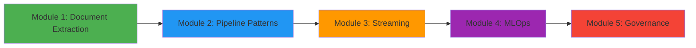

# 🚀 AI Data Engineer Bootcamp

> A comprehensive, hands-on bootcamp for mastering modern data engineering with AI integration, featuring Apache Airflow 3.0, LLMs, and production-ready architectures.

## 📋 Table of Contents
- [Overview](#overview)
- [Prerequisites](#prerequisites)
- [Bootcamp Structure](#bootcamp-structure)
- [Module Details](#module-details)
- [Technology Stack](#technology-stack)
- [Getting Started](#getting-started)
- [Learning Path](#learning-path)

## 🎯 Overview

This bootcamp provides a practical, project-based approach to becoming an AI-powered Data Engineer. You'll build real-world data pipelines, implement document intelligence systems, and master modern orchestration patterns using cutting-edge technologies.

### Key Features
- **Production-Ready Code**: All examples follow industry best practices
- **Progressive Complexity**: Each module builds upon previous concepts
- **AI-First Approach**: Integration of LLMs and machine learning throughout
- **Cloud-Native Architecture**: Designed for scalability and modern deployments

## 📚 Prerequisites

### Required Knowledge
- Python programming (intermediate level)
- SQL fundamentals
- Basic understanding of REST APIs
- Command line proficiency

### Recommended Experience
- Docker basics
- Cloud services familiarity (AWS/GCP/Azure)
- Git version control

## 🗂️ Bootcamp Structure

The bootcamp is organized into progressive modules, each focusing on specific aspects of AI-powered data engineering:

```
ai-data-engineer-bootcamp/
├── src/
│   ├── mod-1-document-extract/    
│   ├── mod-2-data-pipeline/       
│   ├── mod-3-streaming/           
│   ├── mod-4-mlops/              
│   └── mod-5-governance/         
├── storage/                       
├── scripts/                       
└── docs/                         
```

## 📦 Module Details

### Module 1: Document Intelligence & Extraction
**`src/mod-1-document-extract/`**

Learn to build intelligent document processing pipelines using Apache Airflow 3.0 and LLMs.

#### 🎓 What You'll Learn
- Apache Airflow 3.0 fundamentals and DAG development
- PDF processing and text extraction techniques
- LLM integration for structured data extraction
- Progressive optimization patterns (V1 → V2 → V3)
- Asset-based scheduling and event-driven architectures

#### 🛠️ Technologies
- Apache Airflow 3.0
- OpenAI GPT-4
- MinIO (S3-compatible storage)
- PostgreSQL
- Docker & Docker Compose
- Airflow AI SDK

#### 📂 Key Components
```
mod-1-document-extract/
├── dags/
│   ├── uber-eats-inv-extractor-v1.py  
│   ├── uber-eats-inv-extractor-v2.py  
│   ├── uber-eats-inv-extractor-v3.py  
│   └── extract_invoices_intelligence_lang.py  
├── schemas/                            
├── docker-compose.yaml                 
└── requirements.txt                 
```

#### 💡 Key Concepts
- **Evolution Pattern**: See how a simple DAG evolves into an optimized, production-ready pipeline
- **Cost Optimization**: Learn to reduce LLM API costs by 80% through batching
- **Modern Patterns**: Task groups, asset scheduling, context managers
- **Clean Code**: No inline comments, comprehensive docstrings

#### Performance Metrics
| Version | API Calls | Processing Time | Cost |
|---------|-----------|-----------------|------|
| V1 | 20 calls | ~10 min | $0.20 |
| V2 | 4 calls | ~4 min | $0.04 |
| V3 | 4 calls | ~4 min | $0.04 |

---

### 📦 Module 2: Advanced Data Pipeline Patterns (Coming Soon)
**`src/mod-2-data-pipeline/`**

Master complex data pipeline patterns including CDC, SCD, and data quality frameworks.

#### 🎓 What You'll Learn
- Change Data Capture (CDC) implementation
- Slowly Changing Dimensions (SCD) strategies
- Data quality and validation frameworks
- Pipeline monitoring and alerting
- Error handling and recovery patterns

---

### 📦 Module 3: Real-time Data Processing (Coming Soon)
**`src/mod-3-streaming/`**

Build real-time data processing systems with streaming architectures.

#### 🎓 What You'll Learn
- Apache Kafka integration with Airflow
- Stream processing patterns
- Real-time analytics pipelines
- Event-driven architectures
- Windowing and aggregation strategies

---

### 📦 Module 4: MLOps & Model Deployment (Coming Soon)
**`src/mod-4-mlops/`**

Implement MLOps practices for model training, deployment, and monitoring.

#### 🎓 What You'll Learn
- ML pipeline orchestration
- Model versioning and registry
- A/B testing frameworks
- Model monitoring and drift detection
- Feature store integration

---

### 📦 Module 5: Data Governance & Quality (Coming Soon)
**`src/mod-5-governance/`**

Establish robust data governance and quality assurance practices.

#### 🎓 What You'll Learn
- Data lineage tracking
- Privacy and compliance (GDPR, CCPA)
- Data cataloging and discovery
- Quality metrics and SLAs
- Access control and security

## 🔧 Technology Stack

### Core Technologies
- **Orchestration**: Apache Airflow 3.0
- **Language**: Python 3.11+
- **LLMs**: OpenAI GPT-4, Claude
- **Databases**: PostgreSQL, MongoDB
- **Storage**: MinIO (S3-compatible)
- **Streaming**: Apache Kafka
- **Containerization**: Docker & Kubernetes

### AI/ML Stack
- **Frameworks**: LangChain, Airflow AI SDK
- **Vector DB**: Pinecone, Weaviate
- **Monitoring**: Langfuse, Weights & Biases
- **Model Registry**: MLflow

## 🚀 Getting Started

### 1. Clone the Repository
```bash
git clone https://github.com/yourusername/ai-data-engineer-bootcamp.git
cd ai-data-engineer-bootcamp
```

### 2. Environment Setup
```bash
python -m venv venv
source venv/bin/activate

pip install -r requirements.txt
```

### 3. Start with Module 1
```bash
cd src/mod-1-document-extract

pip install -r requirements.txt

docker-compose up -d


open http://localhost:8080 
```

### 4. Configure Connections
Set up required connections in Airflow UI:
- `minio_default`: MinIO connection
- `openai_default`: OpenAI API
- `invoice_db`: PostgreSQL

## Learning Path

### Recommended Progression



## 🎯 Learning Objectives

By completing this bootcamp, you will be able to:

1. **Design and implement** production-ready data pipelines using Apache Airflow 3.0
2. **Integrate LLMs** for intelligent data processing and extraction
3. **Optimize costs** through efficient batching and resource management
4. **Build event-driven** architectures with asset-based scheduling
5. **Implement MLOps** practices for model deployment and monitoring
6. **Establish governance** frameworks for data quality and compliance
7. **Deploy scalable** solutions using cloud-native technologies
8. **Apply best practices** for code organization and documentation

## 🤝 Contributing

Contributions are welcome! Please read our [Contributing Guidelines](CONTRIBUTING.md) before submitting PRs.

## 🙏 Acknowledgments

- Apache Airflow community for the amazing orchestration platform
- OpenAI for GPT models and AI capabilities
- Astronomer for Airflow AI SDK and best practices
- All contributors and learners who make this bootcamp better

## 📬 Contact & Support

- **Issues**: [GitHub Issues](https://github.com/yourusername/ai-data-engineer-bootcamp/issues)
- **Discussions**: [GitHub Discussions](https://github.com/yourusername/ai-data-engineer-bootcamp/discussions)
- **Email**: your.email@example.com

---

<p align="center">
  <strong>🚀 Start your journey to becoming an AI-powered Data Engineer today!</strong>
</p>

<p align="center">
  Made with ❤️ by the AI Data Engineering Community
</p>