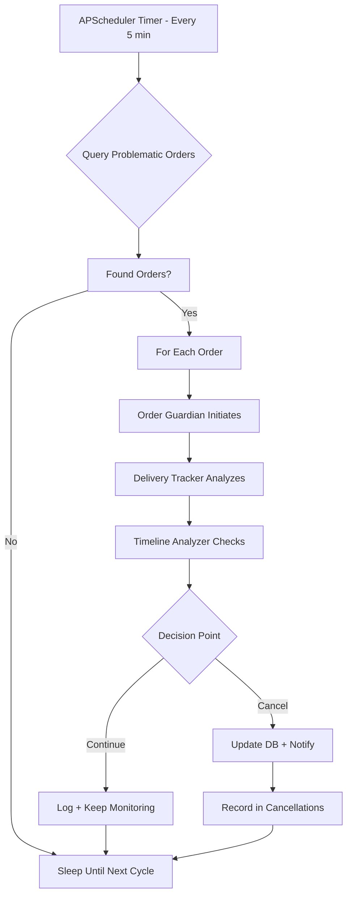

# 🎯 Practical End-to-End Walkthrough: From Order Creation to AI Decision

This guide walks you through the **entire journey** of an order - from creation to potential cancellation by AI agents. Follow along step-by-step to understand how the system works in practice.

---

## 📖 Story: "The Stuck Driver Scenario"

*It's Friday evening. Customer Sarah ordered sushi 45 minutes ago. The driver picked it up but hasn't moved in 30 minutes. Let's see how our AI system handles this...*

---

## 🔧 Step 1: Initial Setup & Database Check

### 1.1 First, let's clear any existing test data
```sql
-- Connect to your database
psql -U your_user -d your_database

-- Clear existing test data (optional)
TRUNCATE TABLE cancellations CASCADE;
DELETE FROM order_events;
DELETE FROM orders;
DELETE FROM drivers;

-- Verify empty state
SELECT 'Orders' as table_name, COUNT(*) as count FROM orders
UNION ALL
SELECT 'Drivers', COUNT(*) FROM drivers;
```

### 1.2 Check database schema is ready
```sql
-- List all tables
\dt

-- Expected tables:
-- drivers, orders, order_events, cancellations, problematic_orders (view)
```

---

## 🎲 Step 2: Generate Realistic Test Data

### 2.1 Run data generator
```bash
python main.py generate-data
```

**What happens behind the scenes:**
```python
# The generator creates 4 types of orders:
# 1. Normal orders (3) - Should NOT be cancelled
# 2. Stuck driver (2) - Driver not moving >20 min
# 3. Overdue orders (2) - Past delivery time >45 min  
# 4. Driver offline (1) - Driver disappeared
```

### 2.2 Verify data was created
```sql
-- Check what was generated
SELECT 
    o.id,
    o.order_number,
    o.status,
    o.customer_name,
    d.name as driver_name,
    d.status as driver_status
FROM orders o
JOIN drivers d ON o.driver_id = d.id
ORDER BY o.id;
```

**Expected output:**
```
 id | order_number  | status           | customer_name | driver_name    | driver_status
----+---------------+-----------------+--------------+----------------+--------------
  1 | ORD33586041   | out_for_delivery | Sarah Chen    | John Smith     | online
  2 | ORD45678901   | delivered       | Mike Brown    | Lisa Wang      | online
  3 | ORD78901234   | delivered       | Emma Davis    | Carlos Garcia  | online
  4 | ORD11223344   | out_for_delivery | Alex Kim      | Maria Rodriguez| online
  5 | ORD55667788   | out_for_delivery | David Lee     | James Wilson   | online
  6 | ORD99887766   | out_for_delivery | Sophie Martin | Robert Johnson | online
  7 | ORD22334455   | out_for_delivery | Oliver Taylor | Emily Davis    | online
  8 | ORD66778899   | out_for_delivery | Isabella Wong | Michael Chen   | offline
```

---

## 🔍 Step 3: Identify Problem Orders (Like a Human Would)

### 3.1 Check normal vs problematic orders
```sql
-- First, let's see orders that are fine (recently created, on time)
SELECT 
    order_number,
    customer_name,
    status,
    EXTRACT(EPOCH FROM (NOW() - created_at))/60 as age_minutes,
    CASE 
        WHEN estimated_delivery_time > NOW() THEN 'On Time'
        ELSE 'OVERDUE'
    END as delivery_status
FROM orders
WHERE status IN ('out_for_delivery', 'delivered')
ORDER BY age_minutes;
```

### 3.2 Find the problematic ones
```sql
-- Now find orders that need attention
SELECT 
    o.id,
    o.order_number,
    o.customer_name,
    o.status,
    EXTRACT(EPOCH FROM (NOW() - o.created_at))/60 as order_age_min,
    EXTRACT(EPOCH FROM (NOW() - o.estimated_delivery_time))/60 as overdue_min,
    d.name as driver_name,
    d.status as driver_status,
    EXTRACT(EPOCH FROM (NOW() - d.last_movement))/60 as driver_stuck_min
FROM orders o
LEFT JOIN drivers d ON o.driver_id = d.id
WHERE o.status = 'out_for_delivery'
    AND (
        -- Order is overdue by more than 45 minutes
        o.estimated_delivery_time < NOW() - INTERVAL '45 minutes'
        OR 
        -- Driver hasn't moved in 20 minutes
        d.last_movement < NOW() - INTERVAL '20 minutes'
        OR
        -- Driver is offline
        d.status = 'offline'
    )
ORDER BY overdue_min DESC;
```

**You'll see something like:**
```
 id | order_number | customer_name | overdue_min | driver_stuck_min | driver_status
----+--------------+--------------+-------------+-----------------+--------------
  6 | ORD99887766  | Sophie Martin |    125.5    |      125.5      | online
  7 | ORD22334455  | Oliver Taylor |    118.2    |      118.2      | online  
  8 | ORD66778899  | Isabella Wong |    110.8    |       95.3      | offline
```

### 3.3 Use the built-in view for monitoring
```sql
-- The system has a pre-built view for this
SELECT * FROM problematic_orders;

-- This view automatically finds orders that are:
-- 1. Status = 'out_for_delivery'
-- 2. Created > 30 minutes ago
-- 3. Not already cancelled
```

---

## 🤖 Step 4: AI Agents Take Over

### 4.1 Manual trigger - Analyze a specific problematic order
```bash
# Let's analyze order #6 (Sophie's stuck order)
python main.py analyze 6
```

**Watch the multi-agent process unfold:**

```
╔══════════════════════════════════════════════════════════╗
║     Single Order Analysis                               ║
║     Order ID: 6                                          ║
╚══════════════════════════════════════════════════════════╝

🔌 Testing database connection...
✅ Database connection successful

🤖 Initializing CrewAI agents...
🔍 Analyzing order 6...

┌─────────────────────────────────────────────┐
│ AGENT 1: Order Guardian (Orchestrator)     │
│ "I need to investigate order ORD99887766"  │
│ Action: Query order details                │
└─────────────────────────────────────────────┘
            ↓
┌─────────────────────────────────────────────┐
│ AGENT 2: Delivery Tracker                  │
│ "Checking driver Robert Johnson's status"  │
│ Finding: Driver stuck for 125 minutes!     │
│ GPS shows no movement at all               │
│ Risk Assessment: HIGH                      │
└─────────────────────────────────────────────┘
            ↓
┌─────────────────────────────────────────────┐
│ AGENT 3: Timeline Analyzer                 │
│ "Evaluating SLA compliance"                │
│ Finding: Order 125 minutes overdue!        │
│ SLA Status: SEVERELY_VIOLATED              │
│ Customer impact: CRITICAL                  │
└─────────────────────────────────────────────┘
            ↓
┌─────────────────────────────────────────────┐
│ FINAL DECISION: Order Guardian             │
│                                            │
│ Decision: CANCEL                           │
│ Confidence: 95%                            │
│ Reason: "Driver stuck + Severely overdue"  │
│                                            │
│ Actions taken:                             │
│ ✓ Order status → Cancelled                │
│ ✓ Customer notification sent              │
│ ✓ Refund initiated                        │
└─────────────────────────────────────────────┘
```

### 4.2 Check what the AI decided
```sql
-- See the cancellation record
SELECT 
    c.id,
    o.order_number,
    o.customer_name,
    c.reason,
    c.confidence_score,
    c.cancelled_at
FROM cancellations c
JOIN orders o ON c.order_id = o.id
WHERE o.id = 6;
```

### 4.3 View the detailed AI reasoning
```sql
-- The AI's full analysis is stored in JSON
SELECT 
    agent_decision,
    driver_analysis,
    timeline_analysis,
    guardian_decision
FROM cancellations
WHERE order_id = 6;

-- You can extract specific insights:
SELECT 
    agent_decision->>'primary_reason' as main_issue,
    agent_decision->>'confidence_score' as confidence,
    agent_decision->'supporting_factors' as factors
FROM cancellations
WHERE order_id = 6;
```

---

## ⚙️ Step 5: Automatic Monitoring Process

### 5.1 Start the monitoring system
```bash
# This runs every 5 minutes automatically
python main.py monitor
```

**What happens every 5 minutes:**

```python
# 1. QUERY: Find problematic orders
SELECT * FROM problematic_orders;
# Found: 7 orders need attention

# 2. ITERATE: For each order
for order in problematic_orders:
    # 3. ANALYZE: Run 3-agent analysis
    crew.analyze_order(order.id)
    
    # 4. DECIDE: Based on findings
    if driver_stuck AND severely_overdue:
        CANCEL with 95% confidence
    elif mildly_overdue:
        CONTINUE monitoring
    
    # 5. EXECUTE: Take action
    if decision == "CANCEL":
        - Update order status
        - Log to cancellations table
        - Send notifications
        - Record in order_events
```

### 5.2 Monitor the logs in real-time
```bash
# In another terminal, watch the activity
tail -f abandoned_orders.log

# You'll see:
2024-01-15 18:30:00 - Starting monitoring cycle
2024-01-15 18:30:01 - Found 7 problematic orders
2024-01-15 18:30:02 - Analyzing order ORD99887766
2024-01-15 18:30:15 - Decision: CANCEL (confidence: 0.95)
2024-01-15 18:30:16 - Analyzing order ORD22334455
2024-01-15 18:30:29 - Decision: CANCEL (confidence: 0.92)
...
```

---

## 📊 Step 6: Track Results & Impact

### 6.1 See all AI decisions made
```sql
-- Summary of all cancellations
SELECT 
    DATE(c.cancelled_at) as date,
    COUNT(*) as orders_cancelled,
    AVG(c.confidence_score) as avg_confidence,
    STRING_AGG(c.reason_category, ', ') as reasons
FROM cancellations c
GROUP bolognaDATE(c.cancelled_at)
ORDER BY date DESC;
```

### 6.2 Measure system effectiveness
```sql
-- Calculate key metrics
WITH metrics AS (
    SELECT 
        COUNT(*) FILTER (WHERE status = 'delivered') as delivered,
        COUNT(*) FILTER (WHERE status = 'cancelled') as cancelled,
        COUNT(*) FILTER (WHERE status = 'out_for_delivery' 
            AND estimated_delivery_time < NOW() - INTERVAL '45 minutes') as still_stuck
    FROM orders
)
SELECT 
    delivered,
    cancelled,
    still_stuck,
    ROUND(delivered::numeric / NULLIF(delivered + cancelled, 0) * 100, 1) as success_rate,
    CASE 
        WHEN still_stuck = 0 THEN 'All problems resolved! ✅'
        ELSE still_stuck || ' orders still need attention ⚠️'
    END as system_status
FROM metrics;
```

### 6.3 Audit trail - See everything that happened
```sql
-- Complete timeline for a specific order
SELECT 
    event_type,
    event_description,
    agent_involved,
    timestamp
FROM order_events
WHERE order_id = 6
ORDER BY timestamp;

-- Output shows full journey:
-- order_created → driver_assigned → picked_up → 
-- driver_stuck_detected → analysis_started → 
-- cancellation_decision → customer_notified
```

---

## 🎬 Step 7: The Complete Dashboard View

### 7.1 Run the dashboard
```bash
python dashboard.py
```

**You'll see:**
```
======================================================================
               🚀 ABANDONED ORDER DETECTION DASHBOARD
======================================================================

📊 ORDER METRICS
----------------------------------------
  Total Orders: 8
  ✅ Delivered: 2
  ❌ Cancelled: 5
  🚗 In Transit: 1
  Success Rate: 28.6%

⚠️ PROBLEM DETECTION
----------------------------------------
  Problematic Orders: 1
  Average Overdue: 45 minutes

🤖 RECENT AI DECISIONS
----------------------------------------
  Order #ORD99887766
    Action: CANCELLED
    Confidence: 95%
    Reason: stuck_driver + overdue_delivery
```

---

## 🔄 Step 8: Understanding the Trigger Process

### The Monitoring Loop Explained



### Trigger Points in Code

```python
# scheduler.py - The trigger mechanism
class OrderMonitorScheduler:
    def __init__(self):
        self.scheduler = BackgroundScheduler()
        # THIS IS THE TRIGGER: Runs monitor_orders every N minutes
        self.scheduler.add_job(
            func=self.monitor_orders,
            trigger="interval",
            minutes=int(os.getenv('MONITORING_INTERVAL_MINUTES', 5)),
            id='monitor_orders'
        )
    
    def monitor_orders(self):
        # STEP 1: Find problems
        problematic_orders = get_problematic_orders()
        
        # STEP 2: Trigger AI analysis for each
        for order in problematic_orders:
            result = self.crew.analyze_order(order['id'])
            
            # STEP 3: Execute decision
            if result['decision'] == 'CANCEL':
                self.execute_cancellation(order['id'])
```

---

## 💡 Key Insights & Patterns

### 1. **Problem Detection SQL Pattern**
```sql
-- The system continuously looks for this pattern:
WHERE status = 'out_for_delivery'
  AND created_at < NOW() - INTERVAL '30 minutes'
  AND (overdue > 45 OR driver_stuck > 20 OR driver_offline)
```

### 2. **Agent Collaboration Pattern**
```
Data Gathering → Risk Assessment → Decision Making
(Order Guardian) → (Tracker + Analyzer) → (Guardian decides)
```

### 3. **Confidence Scoring Logic**
- **95-100%**: Multiple red flags (stuck + overdue + offline)
- **80-94%**: Clear problem (severely overdue OR stuck long time)
- **70-79%**: Moderate issue (mildly overdue)
- **<70%**: Keep monitoring (don't cancel yet)

### 4. **Database State Transitions**
```
orders.status: 'pending' → 'confirmed' → 'out_for_delivery' → 'delivered'/'cancelled'
                                              ↑                        ↑
                                              │                        │
                                    AI monitors this state    AI can trigger this
```

---

## 🎯 Practice Exercises

### Exercise 1: Find the longest stuck driver
```sql
-- Your query here:
SELECT 
    d.name,
    d.status,
    EXTRACT(EPOCH FROM (NOW() - d.last_movement))/60 as stuck_minutes,
    COUNT(o.id) as active_orders
FROM drivers d
LEFT JOIN orders o ON d.id = o.driver_id AND o.status = 'out_for_delivery'
WHERE d.last_movement < NOW() - INTERVAL '10 minutes'
GROUP BY d.id, d.name, d.status, d.last_movement
ORDER BY stuck_minutes DESC
LIMIT 1;
```

### Exercise 2: Trigger analysis for all problematic orders
```python
# Python script to analyze all at once:
from database.connection import get_problematic_orders
from crews.abandoned_order_crew import AbandonedOrderCrew

crew = AbandonedOrderCrew()
orders = get_problematic_orders()

for order in orders:
    print(f"Analyzing {order['order_number']}...")
    result = crew.analyze_order(order['id'])
    print(f"  Decision: {result['decision']}")
    print(f"  Confidence: {result['confidence_score']*100:.0f}%")
```

### Exercise 3: Calculate false positive rate
```sql
-- Find orders that were cancelled but shouldn't have been
-- (delivered < 30 min overdue, driver moved recently)
SELECT 
    COUNT(*) FILTER (WHERE c.id IS NOT NULL 
        AND EXTRACT(EPOCH FROM (o.estimated_delivery_time - o.actual_delivery_time))/60 < 30) as false_positives,
    COUNT(*) as total_cancellations,
    ROUND(
        COUNT(*) FILTER (WHERE c.id IS NOT NULL 
            AND EXTRACT(EPOCH FROM (o.estimated_delivery_time - o.actual_delivery_time))/60 < 30)::numeric 
        / NULLIF(COUNT(*), 0) * 100, 2
    ) as false_positive_rate
FROM orders o
LEFT JOIN cancellations c ON o.id = c.order_id;
```

---

## 🚀 Quick Reference Commands

```bash
# Generate fresh data
python main.py generate-data

# Check system status
python main.py status

# Analyze specific order
python main.py analyze <order_id>

# Start monitoring
python main.py monitor

# View dashboard
python dashboard.py

# Check database
psql -c "SELECT * FROM problematic_orders"

# Watch logs
tail -f abandoned_orders.log
```

---

## 📝 Summary: The Journey

1. **Orders Created** → Some become problematic (stuck/overdue)
2. **Problems Detected** → SQL view identifies issues
3. **AI Agents Activated** → 3 specialized agents analyze
4. **Decision Made** → Cancel or continue with confidence score
5. **Action Executed** → Database updated, customer notified
6. **Monitoring Continues** → Every 5 minutes, automatically

This is how AI transforms reactive customer service into proactive problem resolution!

---

*Remember: The goal is to catch problems before customers complain. Every cancelled order is a prevented 1-star review.*