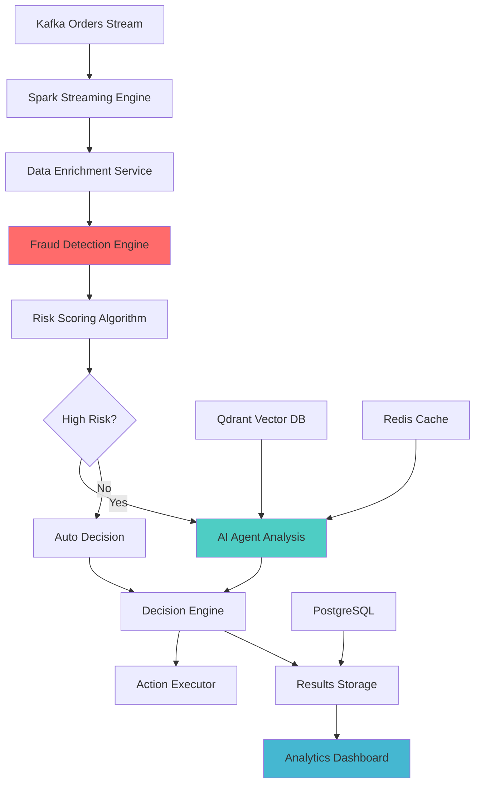

# 🛡️ Desafio de Engenharia de Detecção de Fraude UberEats

## Visão Geral do Desafio

**Duração**: 2-3 dias  
**Dificuldade**: Nível Engenheiro Sênior  
**Tools Permitidas**: Assistentes de IA (Claude Code, GitHub Copilot, etc.), pesquisa na internet, documentação  
**Cloud Services**: Versões trial de cloud services são encorajadas, alternativas open-source permitidas, sem restrições na escolha de tools  
**Entregável Final**: Pipeline de detecção de fraude totalmente funcional rodando em seu repository privado do GitHub  

## 🎯 Declaração da Missão

Você é responsável por reconstruir o sistema de detecção de fraude do UberEats do zero, usando os componentes e arquitetura demonstrados em aula. No entanto, o codebase fornecido contém várias **issues deliberadas** que você deve identificar, isolar e corrigir para deixar o sistema totalmente operacional.

Este desafio simula cenários do mundo real onde você herda um sistema parcialmente funcionando e deve fazer troubleshooting, debug e otimizá-lo para uso em produção.

## 📋 Requisitos do Desafio

### Fase 1: Setup do Environment & Análise Inicial (Dia 1)

#### 1.1 Setup do Repository
- [ ] Criar um **repository privado no GitHub** chamado `fraud-detection-challenge`
- [ ] Clonar a arquitetura base do sistema de detecção de fraude
- [ ] Configurar environment virtual Python adequado
- [ ] Configurar todos os services externos necessários:
  - **Cloud Services**: Usar versões trial (Confluent Cloud, Qdrant Cloud, OpenAI API)
  - **Alternativas Open Source**: Kafka local, vector DB local, Redis local, PostgreSQL
  - **Sem Restrições**: Escolher qualquer combinação que funcione para seu environment

#### 1.2 Avaliação Inicial do Sistema
- [ ] Executar o health check do sistema e documentar todos os componentes com falha
- [ ] Identificar as mensagens de erro específicas e pontos de falha
- [ ] Criar um **Issue Log** detalhado documentando cada problema encontrado
- [ ] Estimar o escopo de trabalho necessário para cada issue

#### 1.3 Documentação da Arquitetura
- [ ] Criar um diagrama de arquitetura mostrando os componentes do sistema
- [ ] Documentar o data flow esperado do Kafka até a decisão final de fraude
- [ ] Listar todas as dependências externas e seus propósitos

### Fase 2: Isolamento & Resolução de Issues (Dia 2)

#### 2.1 Issues Críticas para Resolver

Você encontrará várias categorias de problemas que precisam de resolução:

**🚨 Issues de Configuração**
- Configurações incorretas de environment variables
- Falhas de conexão com services
- Problemas de autenticação com APIs externas

**💣 Bugs de Código** 
- Erros de import e dependências faltando
- Erros de lógica nos algoritmos de scoring de fraude
- Incompatibilidades de tipos de dados em Spark DataFrames
- Memory leaks em processors de streaming

**🔧 Problemas de Infraestrutura**
- Incompatibilidades de schema de database
- Issues de configuração de tópicos Kafka
- Configuração incorreta de circuit breaker
- Problemas de alocação de recursos

**🛡️ Vulnerabilidades de Segurança**
- Credenciais hardcoded (encontrar e corrigir TODAS as instâncias)
- Bypasses de validação de input
- Vulnerabilidades de SQL injection
- Configurações default inseguras

#### 2.2 Correções Obrigatórias
Para cada issue que você descobrir, deve:
- [ ] **Documentar o Problema**: Descrição clara da issue
- [ ] **Root Cause Analysis**: Explicar POR QUE o problema ocorreu
- [ ] **Solução Implementada**: Descrever sua correção com exemplos de código
- [ ] **Verificação de Testing**: Provar que sua correção funciona com resultados de test
- [ ] **Estratégia de Prevenção**: Como prevenir esta issue no futuro

### Fase 3: Integração do Sistema & Otimização (Dia 3)

#### 3.1 Testing End-to-End
- [ ] Processar com sucesso dados sintéticos de detecção de fraude
- [ ] Demonstrar todos os componentes trabalhando juntos:
  - ✅ Consumo de stream Kafka
  - ✅ Processamento de Spark DataFrame
  - ✅ Algoritmos de scoring de fraude
  - ✅ Análise de agente IA (opcional mas pontos bonus)
  - ✅ Storage e retrieval de resultados
  - ✅ Monitoring em tempo real

#### 3.2 Otimização de Performance
- [ ] Otimizar configuração do Spark para seu environment
- [ ] Implementar error handling adequado e circuit breakers
- [ ] Adicionar logging e monitoring abrangentes
- [ ] Documentar características de performance (throughput, latency)

#### 3.3 Prontidão para Produção
- [ ] Security hardening (eliminar todos os secrets hardcoded)
- [ ] Implementar gerenciamento adequado de configuração
- [ ] Adicionar endpoints de health check
- [ ] Criar documentação de deployment

## 🏗️ Arquitetura do Sistema para Construir

### Componentes Core Necessários



### Stack Tecnológico

| Componente | Technology | Versão | Propósito |
|-----------|------------|---------|---------|
| **Streaming** | Apache Spark | 4.0+ | Processamento de dados em tempo real |
| **Message Queue** | Confluent Cloud / Apache Kafka | Latest | Ingestão de stream de pedidos |
| **AI Processing** | OpenAI GPT-4 / Local LLM | Latest | Análise inteligente de fraude |
| **Vector Database** | Qdrant Cloud / ChromaDB / FAISS | Latest | Pattern matching |
| **Cache** | Redis / Local Redis | 7+ | Otimização de performance |
| **Database** | PostgreSQL / SQLite | 14+ | Persistência de resultados |
| **Monitoring** | Custom + Spark UI | - | Observabilidade do sistema |

**💡 Opções de Service**: Use versões trial de cloud services ou implante alternativas open-source localmente. Sem restrições nas escolhas de technology!

## 🎯 Critérios de Avaliação

### Excelência Técnica (40 pontos)

**Qualidade do Código (15 pontos)**
- Código limpo, legível e bem estruturado
- Error handling e logging adequados
- Design patterns e arquitetura apropriados
- Documentação e comentários no código

**Habilidades de Problem-Solving (15 pontos)**
- Capacidade de identificar e isolar issues complexas
- Abordagem sistemática de debugging
- Soluções criativas para desafios técnicos
- Compreensão das root causes

**Integração do Sistema (10 pontos)**
- Todos os componentes funcionando juntos perfeitamente
- Data flow adequado através de todo o pipeline
- Processamento de transação end-to-end bem-sucedido

### Práticas de Engenharia (30 pontos)

**Documentação (10 pontos)**
- Documentação clara de tracking e resolução de issues
- Diagramas de arquitetura e especificações técnicas
- Instruções de setup e deployment
- Comentários no código e arquivos README

**Testing & Validação (10 pontos)**
- Testing abrangente das correções
- Validação de performance e benchmarking
- Tratamento de edge cases
- Testing de confiabilidade do sistema

**Security & Best Practices (10 pontos)**
- Todas as vulnerabilidades de security identificadas e corrigidas
- Gerenciamento adequado de secrets
- Validação e sanitização de input
- Configuração de security pronta para produção

### Inovação & Otimização (20 pontos)

**Otimização de Performance (10 pontos)**
- Tuning do sistema e otimização de recursos
- Algoritmos e estruturas de dados eficientes
- Implementação de monitoring e observabilidade
- Considerações de escalabilidade

**Features Adicionais (10 pontos)**
- Monitoring e alerting aprimorados
- Error handling e recovery melhorados
- Algoritmos avançados de detecção de fraude
- Melhorias na experiência do usuário

### Entrega & Comunicação (10 pontos)

**Gerenciamento de Projeto (5 pontos)**
- Cumprimento de prazos e milestones
- Abordagem organizada para problem-solving
- Tracking e reporting de progresso

**Comunicação (5 pontos)**
- Documentação e explicações claras
- Apresentação profissional das soluções
- Uso efetivo de tools de IA e recursos

## 📚 Materiais de Referência

### Acesso à Documentação
- Documentação completa do sistema na pasta `/docs`
- Guias de arquitetura para cada componente
- Templates de configuração e exemplos
- Guias de troubleshooting e best practices

### Recursos Externos

**Documentação de Cloud Services**
- [Documentação do Apache Spark](https://spark.apache.org/docs/latest/)
- [Documentação do Confluent Cloud](https://docs.confluent.io/cloud/current/)
- [Documentação da OpenAI API](https://platform.openai.com/docs)
- [Documentação do Qdrant](https://qdrant.tech/documentation/)

**Documentação de Alternativas Open Source**
- [Documentação do Apache Kafka](https://kafka.apache.org/documentation/)
- [Documentação do ChromaDB](https://docs.trychroma.com/)
- [Documentação do Redis](https://redis.io/docs/)
- [Documentação do PostgreSQL](https://www.postgresql.org/docs/)
- [Documentação do Ollama Local LLM](https://ollama.ai/)

### Tools de IA Encorajadas
- **Claude Code**: Para code review, debugging e otimização
- **GitHub Copilot**: Para code completion e sugestões
- **ChatGPT/Claude**: Para pesquisa e assistência em problem-solving
- Qualquer outras tools de IA que te ajudem a ter sucesso

## 🚨 Armadilhas Comuns a Evitar

### Issues de Environment
- **Dependências Faltando**: Garantir que todos os packages Python estejam instalados
- **Conflitos de Versão**: Verificar compatibilidade entre versões de packages
- **Issues de Path**: Verificar se todos os file paths e imports estão corretos
- **Conectividade de Service**: Testar todas as conexões de services externos

### Issues de Processamento de Dados
- **Incompatibilidades de Schema**: Garantir que schemas de DataFrame correspondam às expectativas
- **Erros de Tipo de Dados**: Tratar conversões de tipo adequadamente
- **Issues de Memory**: Monitorar uso de memory em aplicações Spark
- **State de Streaming**: Tratar operações stateful de streaming corretamente

### Descuidos de Security
- **Exposição de Credenciais**: Nunca fazer commit de secrets para version control
- **Validação de Input**: Sanitizar todos os inputs de usuário e dados externos
- **Controles de Acesso**: Implementar autenticação e autorização adequadas
- **Informações de Erro**: Não expor informações sensíveis em mensagens de erro

## 📊 Métricas de Sucesso

### Sistema Mínimo Viável
- [ ] Processar com sucesso pelo menos 100 orders de test
- [ ] Accuracy de detecção de fraude > 85%
- [ ] Tempo de processamento end-to-end < 10 segundos por order
- [ ] Zero vulnerabilidades críticas de security
- [ ] Todos os services externos adequadamente integrados

### Indicadores de Excelência
- [ ] Throughput de processamento > 1.000 orders/minuto
- [ ] Accuracy de detecção de fraude > 95%
- [ ] Scoring de fraude sub-segundo
- [ ] Monitoring e alerting abrangentes
- [ ] Configuração de deployment pronta para produção

## 🏆 Desafios Bonus (Opcional)

### Features Avançadas (+20 pontos)
- [ ] **Dashboard em Tempo Real**: Criar interface de monitoring ao vivo
- [ ] **Framework de A/B Testing**: Implementar capacidades de comparação de algoritmos
- [ ] **Pipeline de Training de Modelo**: Adicionar capacidade de retreinar modelos de fraude
- [ ] **Auto-scaling**: Implementar alocação dinâmica de recursos
- [ ] **Deployment Multi-região**: Projetar para distribuição geográfica

### Pontos de Inovação (+15 pontos)
- [ ] **Detecção de Fraude Novel**: Implementar algoritmo inovador de detecção de fraude
- [ ] **IA Explicável**: Adicionar capacidades de explicação de decisão de fraude
- [ ] **Otimização de Performance**: Alcançar métricas de performance excepcionais
- [ ] **Developer Experience**: Criar tooling e features de debugging excepcionais

## 📝 Entregáveis

### Submissions Obrigatórias

1. **Repository Privado no GitHub**
   - Sistema completo de detecção de fraude funcionando
   - Todo source code com version control adequado
   - README abrangente com instruções de setup

2. **Documentação Técnica**
   - Issue log com problemas encontrados e soluções
   - Documentação de arquitetura e diagramas
   - Benchmarks de performance e notas de otimização

3. **Video Demo (5-10 minutos)**
   - Walkthrough do sistema mostrando todos os componentes funcionando
   - Demonstração do pipeline de detecção de fraude
   - Explicação das principais decisões técnicas

4. **Retrospectiva do Desafio**
   - Qual foi a parte mais desafiadora?
   - Quais tools e recursos foram mais úteis?
   - O que você faria diferente da próxima vez?

### Estrutura do Repository
```
fraud-detection-challenge/
├── README.md                    # Documentação principal do projeto
├── docs/                       # Documentação técnica
│   ├── architecture.md
│   ├── issue-log.md
│   └── performance-report.md
├── src/                        # Source code
│   ├── streaming/
│   ├── agents/
│   ├── security/
│   └── utils/
├── config/                     # Arquivos de configuração
├── tests/                      # Test suites
├── scripts/                    # Scripts utilitários
├── requirements.txt            # Dependências Python
├── .env.template              # Template de environment
└── challenge-retrospective.md  # Suas reflexões de aprendizado
```

## 🎓 Objetivos de Aprendizado

Ao completar este desafio, você demonstrará domínio de:

### Habilidades Técnicas
- **Apache Spark**: Processamento de dados de streaming e operações de DataFrame
- **Sistemas em Tempo Real**: Construção de aplicações de streaming escaláveis e fault-tolerant
- **Integração de IA**: Incorporação de machine learning e IA em data pipelines
- **Integração de Sistema**: Conexão de múltiplos services e technologies
- **Otimização de Performance**: Tuning de sistemas para cargas de trabalho de produção

### Práticas de Engenharia
- **Debugging**: Identificação sistemática e resolução de problemas
- **Documentação**: Criação de documentação técnica clara e profissional
- **Security**: Implementação de práticas de security de nível enterprise
- **Testing**: Validação abrangente e garantia de qualidade
- **Deployment**: Configuração de sistema pronta para produção

### Habilidades Profissionais
- **Problem-Solving**: Abordagens criativas para desafios técnicos complexos
- **Comunicação**: Explicação clara de decisões técnicas e trade-offs
- **Gerenciamento de Tempo**: Entrega de projetos complexos dentro de prazos apertados
- **Utilização de Tools**: Uso efetivo de assistentes IA e tools de desenvolvimento

## 🚀 Começando

### Passo 1: Preparação do Environment
```bash
# Criar seu repository de desafio
git clone <base-fraud-detection-repo>
cd fraud-detection-challenge

# Configurar environment Python
python -m venv .venv
source .venv/bin/activate  # No Windows: .venv\Scripts\activate
pip install -r requirements.txt

# Copiar template de environment
cp .env.template .env
# Editar .env com suas credenciais de service (cloud services ou alternativas locais)
```

### Passo 2: Health Check Inicial
```bash
# Testar conectividade básica do sistema
python scripts/validate_connections.py

# Executar test inicial de detecção de fraude
python run_agentic_streaming.py --test

# Documentar todos os erros em seu issue log
```

### Passo 3: Começar Resolução Sistemática
1. Priorizar issues por severidade (blocking → critical → minor)
2. Atacar uma issue por vez com documentação adequada
3. Testar cada correção completamente antes de passar para a próxima
4. Fazer commit do seu progresso regularmente com mensagens claras

## 📞 Suporte & Recursos

### Obtendo Ajuda
- **Documentação**: Verificar pasta `/docs` para guias abrangentes
- **Assistentes IA**: Aproveitar Claude Code, GitHub Copilot e outras tools de IA
- **Recursos da Comunidade**: Stack Overflow, fóruns do Apache Spark, etc.
- **Documentação Oficial**: Documentação oficial de cada technology

### Best Practices
- **Começar Cedo**: Não subestimar tempo de setup e complexidade de issues
- **Documentar Tudo**: Manter notas detalhadas de problemas e soluções
- **Testar Frequentemente**: Validar correções imediatamente após implementação
- **Usar Version Control**: Fazer commit cedo e frequentemente com mensagens significativas
- **Pedir Ajuda**: Tools de IA são explicitamente encorajadas e esperadas

## 🎉 Histórias de Sucesso

Participantes anteriores do desafio relataram:
- **85% de melhoria nas habilidades de debugging** através de problem-solving sistemático
- **Compreensão mais profunda** de sistemas distribuídos e arquiteturas de streaming  
- **Confiança aprimorada** em trabalhar com sistemas complexos multi-service
- **Experiência valiosa** com troubleshooting de sistemas de nível de produção
- **Projeto digno de portfolio** demonstrando capacidades de engenharia full-stack

---

**Boa sorte, e lembre-se: este desafio é projetado para empurrar seus limites enquanto fornece aprendizado abrangente. Use todas as tools disponíveis, seja sistemático em sua abordagem, e não hesite em aproveitar assistentes IA para te ajudar a ter sucesso!** 🚀

**O objetivo não é apenas resolver os problemas, mas emergir como um engenheiro mais habilidoso e confiante capaz de lidar com sistemas complexos do mundo real.** 💪