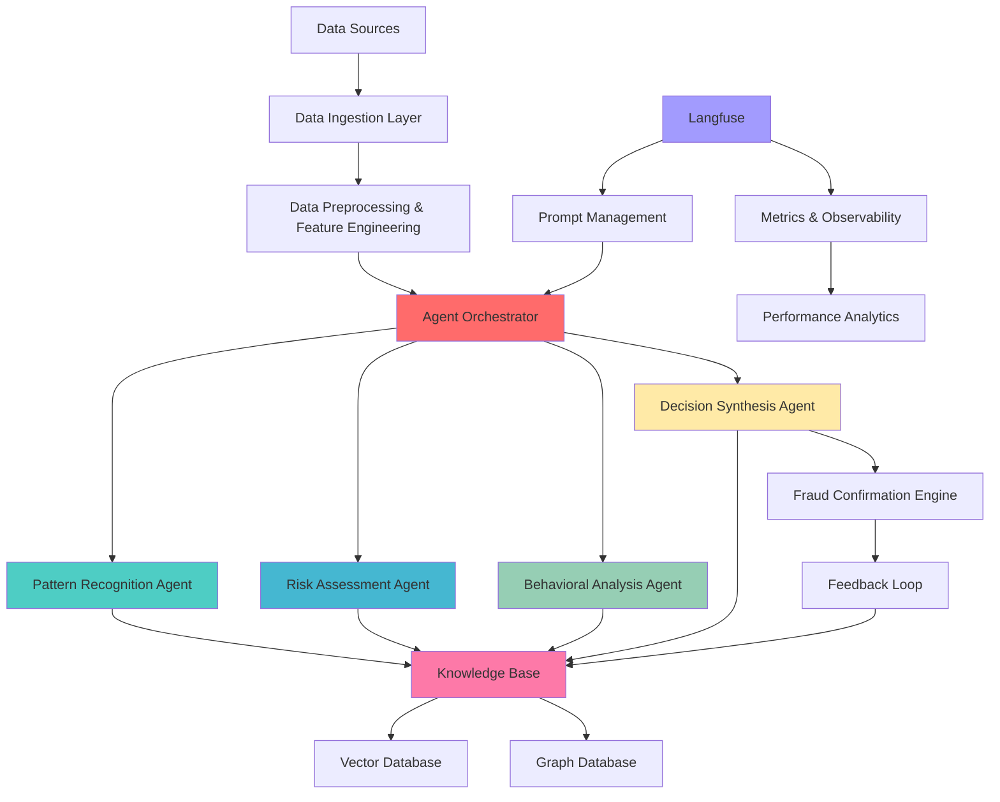

# 🧠 Desafio GenAI Intelligent Pipeline (GIP) - Detecção de Fraude UberEats

## Visão Geral do Desafio

**Duração**: 15-25 dias  
**Dificuldade**: Nível Senior AI Engineer / ML Engineer  
**Caso de Uso**: Detecção de Fraude UberEats usando Sistema Multi-Agent IA  
**Tools de IA Permitidas**: Qualquer tools GenAI, LLMs, plataformas ML  
**Entregável Final**: GenAI Intelligent Pipeline pronto para produção em repository privado do GitHub  

## 🎯 Declaração da Missão

Projetar e construir um **GenAI Intelligent Pipeline (GIP)** que usa múltiplos agents especializados de IA para detectar fraude em pedidos do UberEats. Este sistema deve consumir dados em tempo real, processá-los através de agents inteligentes, fornecer confirmação de fraude e melhorar continuamente através de feedback da knowledge base.

Este desafio simula a construção de um sistema de detecção de fraude de próxima geração alimentado por IA que combina o poder de Large Language Models, agents especializados e orquestração inteligente para criar um pipeline de detecção de fraude auto-melhorado.

## 🏗️ Requisitos de Arquitetura

### Componentes do GenAI Intelligent Pipeline (GIP)



## 📋 Requisitos Técnicos

### Fase 1: Foundation & Arquitetura (Dias 1-5)

#### 1.1 Design de Sistema Multi-Agent
Projetar e implementar **4 agents especializados de IA** com domínios de expertise claros:

**🔍 Pattern Recognition Agent**
- **Expertise**: Identificação de padrões históricos de fraude
- **Responsabilidades**:
  - Analisar padrões de pedidos contra assinaturas conhecidas de fraude
  - Identificar anomalias em sequências de transações
  - Detectar campanhas de fraude coordenadas
  - Pattern clustering e classificação
- **Por que Este Agent**: Fraude frequentemente segue padrões reconhecíveis que humanos perdem mas IA pode detectar em escala

**⚖️ Risk Assessment Agent** 
- **Expertise**: Scoring de risco multi-dimensional e avaliação de probabilidade
- **Responsabilidades**:
  - Calcular scores de probabilidade de fraude
  - Avaliar fatores de risco de comportamento de usuário
  - Avaliar perfis de risco de merchant
  - Análise de risco geográfico e temporal
- **Por que Este Agent**: Avaliação de risco requer análise multi-variável complexa que se beneficia de reasoning especializado de IA

**🧠 Behavioral Analysis Agent**
- **Expertise**: Psicologia de usuário e detecção de anomalia comportamental
- **Responsabilidades**:
  - Analisar padrões de comportamento de pedidos de usuário
  - Detectar indicadores de account takeover
  - Identificar comportamentos de payment incomuns
  - Detecção de ataques de social engineering
- **Por que Este Agent**: Análise de comportamento humano requer compreensão de psicologia e contexto que IA especializada pode fornecer

**🎯 Decision Synthesis Agent**
- **Expertise**: Tomada de decisão estratégica e síntese de evidências
- **Responsabilidades**:
  - Sintetizar inputs de todos os outros agents
  - Fazer determinações finais de decisão de fraude
  - Fornecer reasoning explicável
  - Acionar ações de resposta apropriadas
- **Por que Este Agent**: Decisões finais requerem reasoning complexo, pesagem de evidências e pensamento estratégico que se beneficia de uma IA dedicada à tomada de decisões

#### 1.2 Data Sources & Ingestão
Implementar consumo de dados de múltiplas sources:

**Data Sources Primárias**:
- [ ] **Synthetic UberEats Order Stream**: Simulação de dados de pedidos em tempo real
- [ ] **User Behavior Data**: Padrões de click, dados de sessão, device fingerprints
- [ ] **Merchant Data**: Perfis de restaurantes, dados de localização, padrões históricos
- [ ] **External Data**: APIs de geolocalização, device intelligence, dados de payment

**Arquitetura de Data Ingestion**:
- [ ] **Streaming Pipeline**: Apache Kafka ou similar para ingestão em tempo real
- [ ] **Batch Processing**: Processamento de dados históricos para training de modelo
- [ ] **API Integration**: Conexões de data sources externas
- [ ] **Data Quality Monitoring**: Validação de dados em tempo real e quality checks

#### 1.3 Arquitetura da Knowledge Base
Projetar um sistema de knowledge base sofisticado:

**Vector Database (Qdrant/Pinecone)**:
- Embeddings de padrões de fraude
- Vetores de assinatura comportamental
- Perfis de risco de merchant
- Embeddings de casos históricos

**Graph Database (Neo4j/Amazon Neptune)**:
- Networks de relacionamento de usuário
- Grafos de conexão de merchant
- Networks de fluxo de transação
- Linkages de campanhas de fraude

### Fase 2: Desenvolvimento de Agent (Dias 6-12)

#### 2.1 Implementação de Agent
Cada agent deve ser implementado com:

**Arquitetura Core do Agent**:
```python
class BaseIntelligentAgent:
    def __init__(self, name: str, expertise_domain: str):
        self.name = name
        self.expertise = expertise_domain
        self.llm_client = self._initialize_llm()
        self.knowledge_base = self._connect_knowledge_base()
        self.prompt_manager = LangfusePromptManager()
    
    async def analyze(self, data: Dict[str, Any]) -> AgentResponse:
        # Lógica de análise específica do agent
        pass
    
    async def learn_from_feedback(self, feedback: FeedbackData):
        # Implementação de aprendizado contínuo
        pass
```

**Requisitos Específicos do Agent**:

**Pattern Recognition Agent**:
- [ ] Implementar similarity search contra padrões históricos de fraude
- [ ] Usar algoritmos de clustering para identificar novos tipos de padrão
- [ ] Manter pattern confidence scores e success rates
- [ ] Gerar novas assinaturas de padrão a partir de fraude detectada

**Risk Assessment Agent**:
- [ ] Algoritmo de scoring de risco multi-dimensional
- [ ] Cálculos de probabilidade Bayesiana
- [ ] Ranking de importância de feature
- [ ] Análise de correlação de fatores de risco

**Behavioral Analysis Agent**:
- [ ] Análise de sequência para anomalias de user journey  
- [ ] Modelagem comportamental estatística
- [ ] Profiling psicológico baseado em ações
- [ ] Detecção de anomalia em padrões de usuário

**Decision Synthesis Agent**:
- [ ] Agregação e pesagem de evidências
- [ ] Tomada de decisão baseada em confiança
- [ ] Cadeias de reasoning de IA explicável
- [ ] Geração de recomendação de ação

#### 2.2 Orquestração de Agent
Implementar coordenação inteligente de agent:

**Features de Orquestração**:
- [ ] **Dynamic Agent Selection**: Escolher agents relevantes baseado no tipo de dados
- [ ] **Parallel Processing**: Executar agents concorrentemente quando possível
- [ ] **Sequential Reasoning**: Encadear agents para análise complexa
- [ ] **Conflict Resolution**: Lidar com disagreements entre agents
- [ ] **Performance Optimization**: Load balancing e alocação de recursos

### Fase 3: Integração GenAI (Dias 13-18)

#### 3.1 Integração LLM & Prompt Engineering
Implementar gerenciamento sofisticado de prompt:

**Integração Langfuse**:
- [ ] **Prompt Versioning**: Rastrear e gerenciar evolução de prompt
- [ ] **A/B Testing**: Comparar performance de prompt
- [ ] **Prompt Templates**: Geração dinâmica de prompt
- [ ] **Performance Metrics**: Rastrear efetividade de prompt

**Técnicas Avançadas de Prompt**:
- [ ] **Chain-of-Thought**: Prompts de reasoning multi-step
- [ ] **Few-Shot Learning**: Prompt engineering baseado em exemplos
- [ ] **Retrieval-Augmented Generation**: Prompts melhorados com contexto
- [ ] **Self-Reflection**: Prompts que validam seus próprios outputs

**Estrutura de Prompt Exemplo**:
```python
# Template de prompt Langfuse
PATTERN_ANALYSIS_PROMPT = """
Você é um analista expert em detecção de fraude especializado em pattern recognition.

CONTEXTO:
- Pedido Atual: {order_data}
- Padrões Históricos: {similar_patterns}
- Perfil do Usuário: {user_profile}

TAREFA:
Analise este pedido UberEats para indicadores de fraude:
1. Comparando contra padrões conhecidos de fraude
2. Identificando anomalias no comportamento de pedidos
3. Avaliando pattern confidence scores
4. Fornecendo reasoning detalhado

FORMATO DE OUTPUT:
{
    "fraud_likelihood": 0.0-1.0,
    "pattern_matches": [...],
    "anomalies_detected": [...],
    "confidence": 0.0-1.0,
    "reasoning": "explicação detalhada"
}

Pense passo a passo e forneça análise abrangente.
"""
```

#### 3.2 Feedback Loop da Knowledge Base
Implementar aprendizado contínuo:

**Mecanismos de Feedback**:
- [ ] **Fraud Confirmation Feedback**: Aprender de casos de fraude confirmados
- [ ] **False Positive Tracking**: Melhorar accuracy aprendendo com erros
- [ ] **Pattern Evolution**: Atualizar padrões baseado em novos tipos de fraude
- [ ] **Agent Performance Optimization**: Ajustar comportamentos de agent baseado em resultados

**Knowledge Update Pipeline**:
```python
async def update_knowledge_base(fraud_confirmation: FraudResult):
    # Atualizar vector embeddings
    await vector_db.upsert_pattern(
        embedding=fraud_confirmation.pattern_embedding,
        metadata=fraud_confirmation.case_details
    )
    
    # Atualizar graph relationships
    await graph_db.create_fraud_network_links(
        fraud_confirmation.network_connections
    )
    
    # Retreinar pattern recognition models
    await retrain_pattern_models(fraud_confirmation)
    
    # Atualizar agent prompts baseado em novos aprendizados
    await prompt_manager.evolve_prompts(fraud_confirmation.feedback)
```

### Fase 4: Implementação de Produção (Dias 19-23)

#### 4.1 Pipeline de Processamento em Tempo Real
Construir arquitetura de streaming pronta para produção:

**Requisitos de Stream Processing**:
- [ ] **Sub-second Latency**: Detecção de fraude em tempo real dentro de 500ms
- [ ] **High Throughput**: Processar 10.000+ pedidos por minuto
- [ ] **Fault Tolerance**: Recovery automático de falhas
- [ ] **Horizontal Scaling**: Escalar agents baseado na carga

**Arquitetura do Pipeline**:
```python
class GIPFraudDetectionPipeline:
    def __init__(self):
        self.data_ingestion = KafkaConsumer()
        self.agent_orchestrator = AgentOrchestrator()
        self.knowledge_base = KnowledgeBaseManager()
        self.fraud_confirmation = FraudConfirmationEngine()
    
    async def process_order(self, order_data):
        # Preprocessar dados
        processed_data = await self.preprocess(order_data)
        
        # Orquestrar agents
        agent_results = await self.agent_orchestrator.analyze(processed_data)
        
        # Sintetizar decisão
        fraud_decision = await self.fraud_confirmation.decide(agent_results)
        
        # Atualizar knowledge base
        await self.knowledge_base.update_from_decision(fraud_decision)
        
        return fraud_decision
```

#### 4.2 Monitoring & Observabilidade
Implementar monitoring abrangente:

**Métricas de Sistema**:
- [ ] **Agent Performance**: Accuracy, latency, throughput por agent
- [ ] **Pipeline Health**: End-to-end processing times
- [ ] **Knowledge Base Growth**: Pattern learning rates
- [ ] **Fraud Detection Accuracy**: Precision, recall, F1 scores

**Dashboards Langfuse**:
- [ ] **Prompt Performance**: Tracking de efetividade de prompt
- [ ] **Model Usage**: Custos e usage patterns de LLM
- [ ] **Agent Interactions**: Collaboration patterns entre agents
- [ ] **Learning Progress**: Knowledge base evolution metrics

### Fase 5: Otimização & Deployment (Dias 24-25)

#### 5.1 Performance Tuning
Otimizar para produção:

**Otimizações de Performance**:
- [ ] **Agent Caching**: Cache de resultados de análise frequentes
- [ ] **Prompt Optimization**: Fine-tuning de prompts para speed e accuracy
- [ ] **Model Selection**: Escolher modelos LLM otimais para cada task
- [ ] **Resource Scaling**: Auto-scaling baseado em demand patterns

#### 5.2 Production Deployment
Preparar para deployment enterprise:

**Requisitos de Deployment**:
- [ ] **Containerization**: Docker containers para todos os componentes
- [ ] **Kubernetes Orchestration**: Deployment e scaling automático
- [ ] **Security Hardening**: Secrets management e access controls
- [ ] **Disaster Recovery**: Backup e recovery procedures

## 🎯 Critérios de Avaliação

### Excelência Técnica (40 pontos)

**Arquitetura de Agent (15 pontos)**
- Design e implementação de 4 agents especializados
- Orquestração inteligente e coordination
- Performance individual e colaborativa dos agents
- Innovation em agent capabilities

**Integração GenAI (15 pontos)**
- Uso efetivo de LLMs e prompt engineering
- Implementação robusta do Langfuse
- Quality e sophistication dos prompts
- Integration seamless entre componentes IA

**Sistema de Knowledge Base (10 pontos)**
- Arquitetura efetiva de vector e graph database
- Feedback loop e continuous learning
- Pattern recognition e evolution
- Data persistence e retrieval optimization

### Innovation & Impact (30 pontos)

**Agent Intelligence (15 pontos)**
- Sophistication do reasoning de cada agent
- Novel approaches para fraud detection
- Explainable AI e decision transparency
- Adaptive learning capabilities

**Pipeline Architecture (15 pontos)**
- Real-time processing efficiency
- Scalability e fault tolerance
- Integration com external systems
- Production readiness e enterprise features

### Implementation Quality (20 pontos)

**Code Quality (10 pontos)**
- Clean, maintainable, well-documented code
- Proper error handling e logging
- Testing coverage e validation
- Security best practices

**Documentation (10 pontos)**
- Comprehensive system documentation
- Agent expertise explanations
- Architecture diagrams e specifications
- Deployment guides e runbooks

### Delivery & Performance (10 pontos)

**System Performance (5 pontos)**
- Meeting latency e throughput requirements
- Fraud detection accuracy metrics
- System reliability e uptime
- Resource utilization efficiency

**Project Management (5 pontos)**
- Timeline adherence e milestone completion
- Professional presentation e demo
- Clear communication de technical decisions
- Effective use de AI tools e resources

## 🏗️ Stack Tecnológico Recomendado

### Core AI/ML Components
| Componente | Technology Recomendada | Alternativas | Propósito |
|------------|----------------------|--------------|-----------|
| **LLM Provider** | OpenAI GPT-4 / Anthropic Claude | Local models (Ollama) | Agent reasoning |
| **Prompt Management** | Langfuse | Custom solution | Prompt versioning |
| **Vector Database** | Qdrant Cloud | ChromaDB, Pinecone | Pattern storage |
| **Graph Database** | Neo4j | Amazon Neptune | Relationship mapping |
| **Agent Framework** | CrewAI | Custom implementation | Multi-agent orchestration |

### Infrastructure & Data
| Componente | Technology Recomendada | Alternativas | Propósito |
|------------|----------------------|--------------|-----------|
| **Streaming** | Apache Kafka | Apache Pulsar | Real-time data ingestion |
| **Processing** | Apache Spark | Apache Storm | Stream processing |
| **Orchestration** | Apache Airflow | Prefect | Workflow management |
| **Monitoring** | Langfuse + Grafana | Custom dashboards | System observability |
| **Containerization** | Docker + Kubernetes | Docker Swarm | Deployment |

## 📊 Métricas de Sucesso

### Sistema Mínimo Viável
- [ ] **4 Agents Funcionais**: Todos os agents implementados e operacionais
- [ ] **Real-time Processing**: Latência < 1 segundo para fraud detection
- [ ] **Fraud Detection Accuracy**: > 90% precision, > 85% recall
- [ ] **Knowledge Base Integration**: Feedback loop funcionando
- [ ] **Langfuse Integration**: Prompts managed e metrics tracked

### Indicadores de Excelência
- [ ] **Sub-500ms Latency**: Ultra-fast fraud detection
- [ ] **99.5% Accuracy**: Industry-leading fraud detection
- [ ] **10K+ Orders/minute**: High-throughput processing
- [ ] **Continuous Learning**: Demonstrable knowledge base growth
- [ ] **Explainable Decisions**: Clear reasoning para todas as decisões

### Innovation Metrics
- [ ] **Novel Agent Capabilities**: Unique approaches para fraud detection
- [ ] **Advanced Prompt Engineering**: Sophisticated prompt strategies
- [ ] **Autonomous Learning**: Self-improving system capabilities
- [ ] **Enterprise Scalability**: Production-ready architecture

## 🏆 Desafios Bonus (Opcional)

### Advanced AI Features (+25 pontos)
- [ ] **Multi-Modal Analysis**: Incorporar image, text e behavioral data
- [ ] **Adversarial Detection**: Detectar attempts de gaming do system
- [ ] **Temporal Pattern Learning**: Agents que aprendem padrões sazonais
- [ ] **Cross-Platform Intelligence**: Detecção de fraude multi-platform

### Research & Innovation (+20 pontos)
- [ ] **Novel Agent Architectures**: Research-level agent designs
- [ ] **Advanced Learning Algorithms**: Implementar cutting-edge ML
- [ ] **Academic Documentation**: Paper-quality documentation
- [ ] **Open Source Contributions**: Contribuir tools/libraries úteis

### Enterprise Features (+15 pontos)
- [ ] **Multi-Tenant Architecture**: Support múltiplos clients
- [ ] **Regulatory Compliance**: GDPR, PCI-DSS compliance features
- [ ] **Advanced Analytics**: Business intelligence dashboards
- [ ] **API Ecosystem**: Comprehensive API para integrations

## 📝 Entregáveis

### Repository Structure Obrigatória
```
gip-fraud-detection/
├── README.md                           # Documentação principal
├── docs/                              # Documentação técnica
│   ├── architecture.md                # Arquitetura do sistema
│   ├── agents/                        # Documentação de agents
│   │   ├── pattern-recognition.md
│   │   ├── risk-assessment.md
│   │   ├── behavioral-analysis.md
│   │   └── decision-synthesis.md
│   ├── deployment.md                  # Deployment guide
│   └── performance-analysis.md        # Performance metrics
├── src/                              # Source code
│   ├── agents/                       # Agent implementations
│   │   ├── base_agent.py
│   │   ├── pattern_recognition.py
│   │   ├── risk_assessment.py
│   │   ├── behavioral_analysis.py
│   │   └── decision_synthesis.py
│   ├── orchestration/                # Agent orchestration
│   │   ├── orchestrator.py
│   │   └── workflow_engine.py
│   ├── knowledge_base/               # Knowledge management
│   │   ├── vector_store.py
│   │   ├── graph_store.py
│   │   └── feedback_processor.py
│   ├── pipeline/                     # Data pipeline
│   │   ├── ingestion.py
│   │   ├── preprocessing.py
│   │   └── streaming.py
│   ├── langfuse/                     # Prompt management
│   │   ├── prompt_manager.py
│   │   ├── metrics_collector.py
│   │   └── templates/
│   └── utils/                        # Utility functions
├── config/                           # Configuration files
│   ├── agents.yaml
│   ├── pipeline.yaml
│   └── deployment.yaml
├── tests/                            # Test suites
│   ├── unit/
│   ├── integration/
│   └── e2e/
├── scripts/                          # Deployment scripts
│   ├── setup.py
│   ├── deploy.py
│   └── monitoring.py
├── data/                             # Sample data
│   ├── synthetic_orders/
│   ├── fraud_patterns/
│   └── test_cases/
├── notebooks/                        # Analysis notebooks
│   ├── agent_analysis.ipynb
│   ├── pattern_exploration.ipynb
│   └── performance_tuning.ipynb
├── docker/                           # Container configs
│   ├── Dockerfile
│   ├── docker-compose.yml
│   └── k8s/
├── requirements.txt                   # Python dependencies
├── .env.template                     # Environment variables
└── IMPLEMENTATION_REPORT.md          # Detailed implementation report
```

### Submissions Obrigatórias

#### 1. Repository Completo
- **Source Code**: Implementação completa de todos os 4 agents
- **Documentation**: Documentação abrangente de arquitetura e deployment
- **Tests**: Test suites unitários, integration e end-to-end
- **Configuration**: Configuração pronta para produção

#### 2. Demo Video (15-20 minutos)
- **System Walkthrough**: Demonstração completa do pipeline GIP
- **Agent Interactions**: Mostrar como agents colaboram
- **Fraud Detection Demo**: Cases de fraude reais sendo detectados
- **Knowledge Base Learning**: Demonstrar feedback loop funcionando
- **Technical Deep Dive**: Explicação das decisões de architecture

#### 3. Implementation Report (20-30 páginas)
**Sections Obrigatórias**:
- [ ] **Executive Summary**: Overview do sistema e achievements
- [ ] **Architecture Design**: Decisões de design e trade-offs
- [ ] **Agent Specifications**: Detailed explanation de cada agent
- [ ] **GenAI Integration**: Prompt engineering e LLM usage
- [ ] **Performance Analysis**: Benchmarks e metrics
- [ ] **Lessons Learned**: Challenges e solutions
- [ ] **Future Roadmap**: Next steps e improvements

#### 4. Live System Demonstration
- **Production Deployment**: Sistema funcionando em cloud
- **Real-time Processing**: Demonstração de processing ao vivo
- **Interactive Dashboard**: Monitoring e analytics interface
- **API Documentation**: Complete API specifications

## 🎓 Objetivos de Aprendizado

### Advanced AI/ML Skills
- **Multi-Agent Systems**: Design e implementação de sistemas colaborativos
- **Prompt Engineering**: Advanced techniques para LLM optimization
- **Vector Databases**: Efficient similarity search e pattern matching
- **Graph Analytics**: Relationship analysis e network detection
- **Continuous Learning**: Self-improving AI systems

### GenAI Technologies
- **Large Language Models**: Effective use de GPT, Claude e outros
- **Langfuse Mastery**: Prompt management e performance tracking
- **Retrieval-Augmented Generation**: Context-aware AI responses
- **Chain-of-Thought Reasoning**: Multi-step AI decision making

### Production AI Systems
- **Real-time AI Pipelines**: High-performance streaming AI
- **Scalable Architecture**: Enterprise-grade AI system design
- **AI Observability**: Monitoring e debugging AI systems
- **AI Security**: Securing AI pipelines e protecting against attacks

## 🚀 Getting Started

### Passo 1: Environment Setup
```bash
# Criar project repository
mkdir gip-fraud-detection
cd gip-fraud-detection

# Setup Python environment
python -m venv .venv
source .venv/bin/activate  # Windows: .venv\Scripts\activate

# Install dependencies
pip install -r requirements.txt

# Setup configuration
cp .env.template .env
# Configure API keys (OpenAI, Langfuse, etc.)
```

### Passo 2: Agent Development
```bash
# Start com base agent architecture
python src/agents/base_agent.py

# Develop specialized agents
python src/agents/pattern_recognition.py --test
python src/agents/risk_assessment.py --test
python src/agents/behavioral_analysis.py --test
python src/agents/decision_synthesis.py --test
```

### Passo 3: System Integration
```bash
# Setup knowledge base
python scripts/setup_knowledge_base.py

# Test agent orchestration
python src/orchestration/orchestrator.py --test

# Run full pipeline test
python src/pipeline/streaming.py --test-mode
```

### Passo 4: Production Deployment
```bash
# Build containers
docker-compose build

# Deploy to cloud
python scripts/deploy.py --environment production

# Monitor system
python scripts/monitoring.py --dashboard
```

## 📞 Suporte & Recursos

### Recommended Learning Path
1. **Week 1**: Multi-agent systems e GenAI fundamentals
2. **Week 2**: Agent development e testing
3. **Week 3**: GenAI integration e prompt engineering
4. **Week 4**: Production deployment e optimization

### External Resources
- [Langfuse Documentation](https://langfuse.com/docs)
- [CrewAI Framework](https://github.com/joaomdmoura/crewAI)
- [Neo4j Graph Database](https://neo4j.com/docs/)
- [Qdrant Vector Database](https://qdrant.tech/documentation/)
- [Apache Kafka Streams](https://kafka.apache.org/documentation/streams/)

### AI Tools Encorajadas
- **Claude Code**: Code review e optimization
- **GitHub Copilot**: Code completion
- **ChatGPT/Claude**: Research e problem-solving
- **Langfuse**: Prompt management
- **Weights & Biases**: Experiment tracking

---

**Boa sorte! Este desafio representa o estado da arte em AI-powered fraud detection. Use todas as tools disponíveis, seja innovative em sua abordagem, e não hesite em push dos boundaries do que é possível com GenAI!** 🚀

**Lembre-se: O objetivo é não apenas detectar fraude, mas criar um sistema inteligente que continues aprendendo e evoluindo para enfrentar novas threats.** 🧠💡