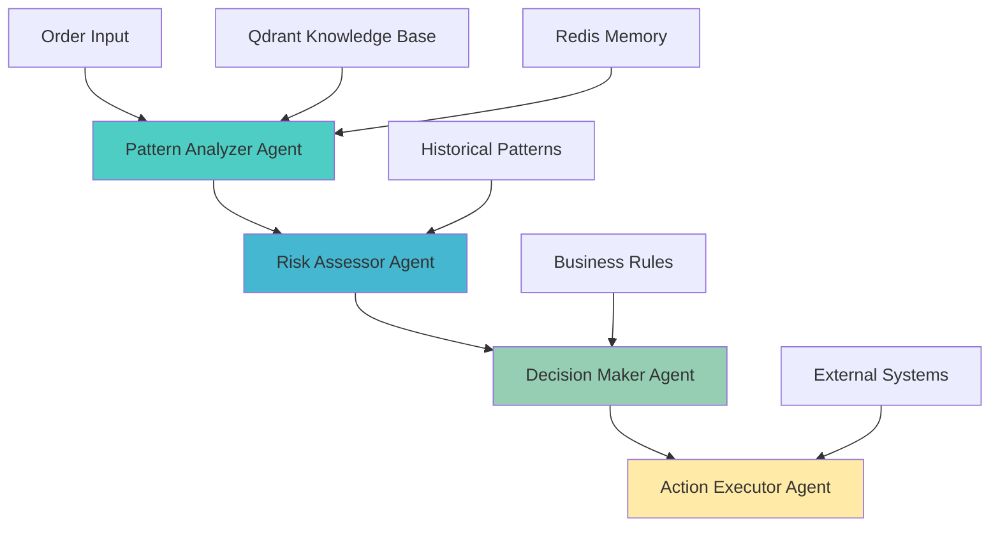

# AI Agents System - Complete Guide

## Overview

The AI Agents system provides intelligent, autonomous fraud detection capabilities using multiple specialized agents working in coordination to analyze order patterns, assess risks, and execute appropriate responses to detected fraud.

## Agent Architecture

### Core Agents

#### 1. Pattern Analyzer Agent
- **Role**: Pattern Recognition and Analysis
- **File**: `src/agents/crewai_with_prompts.py`
- **Responsibilities**:
  - Analyze incoming order data for suspicious patterns
  - Compare against historical fraud cases via RAG system
  - Generate detailed fraud risk assessments
  - Identify correlations between multiple fraud indicators

#### 2. Risk Assessor Agent
- **Role**: Risk Scoring and Classification
- **Responsibilities**:
  - Calculate multi-dimensional risk scores
  - Classify orders into risk categories (low, medium, high, critical)
  - Apply business rules and thresholds
  - Provide confidence levels for assessments

#### 3. Decision Maker Agent
- **Role**: Action Planning and Coordination
- **Responsibilities**:
  - Synthesize inputs from other agents
  - Make final fraud determination decisions
  - Plan appropriate response actions
  - Coordinate with external systems

#### 4. Action Executor Agent
- **Role**: Response Execution and Monitoring
- **Responsibilities**:
  - Execute planned fraud response actions
  - Monitor action outcomes
  - Provide feedback to learning systems
  - Handle escalations and exceptions

## System Architecture

### Agent Workflow



### Memory and Knowledge Integration

#### Vector Database (Qdrant)
- **Purpose**: Store and retrieve fraud patterns, customer behavior patterns
- **Collections**:
  - `fraud_patterns`: Known fraud signatures and patterns
  - `customer_profiles`: Customer behavior baselines
  - `merchant_analytics`: Merchant risk profiles
  - `transaction_contexts`: Contextual fraud indicators

#### Redis Memory System
- **Agent Memory**: Temporary storage for agent context and decisions
- **Session Management**: Track ongoing fraud investigations
- **Performance Caching**: Cache frequently accessed patterns

## Configuration

### Agent Settings (`config/settings.py`)

```python
class AgentConfig(BaseSettings):
    # Execution timeouts
    max_execution_time_seconds: int = Field(default=75, ge=10, le=300)
    pattern_analyzer_timeout: int = Field(default=15)
    risk_assessor_timeout: int = Field(default=12)
    decision_maker_timeout: int = Field(default=10)
    action_executor_timeout: int = Field(default=8)
    
    # Memory settings
    agent_memory: bool = Field(default=True)
    memory_provider: str = Field(default="redis")
    
    # Processing limits
    max_concurrent_agents: int = Field(default=1)
    sequential_processing: bool = Field(default=True)
    
    # Performance optimization
    reduced_token_mode: bool = Field(default=True)
    max_tokens_per_agent: int = Field(default=50)
```

### Environment Variables

```bash
# Agent System Configuration
AGENT_MEMORY_ENABLED=true
AGENT_MEMORY_PROVIDER=redis
AGENT_MAX_EXECUTION_TIME_SECONDS=75
AGENT_VERBOSE_LOGGING=false

# Performance Settings
AGENT_MAX_CONCURRENT_AGENTS=1
AGENT_SEQUENTIAL_PROCESSING=true
AGENT_REDUCED_TOKEN_MODE=true
AGENT_MAX_TOKENS_PER_AGENT=50

# OpenAI Integration
OPENAI_API_KEY=your-openai-api-key
OPENAI_LLM_MODEL=gpt-4o-mini
OPENAI_MAX_TOKENS=50
OPENAI_TEMPERATURE=0.1
```

## Integration with Fraud Detection Pipeline

### Agent Processing Flow

1. **Order Reception**: Orders flagged for agent analysis enter the system
2. **Pattern Analysis**: First agent analyzes order against known fraud patterns
3. **Risk Assessment**: Second agent calculates comprehensive risk scores
4. **Decision Making**: Third agent synthesizes information and makes decisions
5. **Action Execution**: Fourth agent executes appropriate responses

### Circuit Breaker Protection

The agent system includes comprehensive fault tolerance:

```python
# File: src/streaming/agentic_fraud_processor.py
circuit_breaker = CircuitBreaker(
    name='agent_analysis',
    failure_threshold=5,
    recovery_timeout=60.0
)
```

**Benefits**:
- Prevents cascade failures during AI service outages
- Automatic recovery with exponential backoff
- Comprehensive failure logging and alerting

### Performance Optimization

#### Memory Management
- **Queue Size Limits**: Maximum 1000 items to prevent memory leaks
- **Processing Timeouts**: 30-second timeout per analysis (reduced from 180s)
- **Batch Processing**: Efficient handling of multiple orders

#### Cost Optimization
- **Token Limits**: Maximum 50 tokens per agent response
- **Reduced Context Mode**: Streamlined prompts for faster processing
- **Sequential Processing**: Prevents parallel API rate limit issues

## Usage Examples

### Basic Agent Analysis

```python
from src.streaming.agentic_fraud_processor import AgenticFraudProcessor

# Initialize processor
processor = AgenticFraudProcessor()

# Analyze order
result = processor.analyze_order({
    "order_id": "ord_123",
    "user_id": "user_456",
    "total_amount": 299.99,
    "payment_method": "credit_card",
    "merchant_name": "Restaurant ABC"
})

# Access results
print(f"Fraud Decision: {result.decision}")
print(f"Risk Score: {result.risk_score}")
print(f"Agent Reasoning: {result.reasoning}")
```

### Custom Agent Configuration

```python
from src.agents.crewai_with_prompts import FraudDetectionCrew

# Initialize with custom settings
crew = FraudDetectionCrew(
    max_execution_time=60,
    enable_memory=True,
    verbose=True
)

# Run analysis
response = crew.kickoff({
    "order_data": order_dict,
    "context": "high_value_transaction"
})
```

## Monitoring and Debugging

### Agent Performance Metrics

Monitor these key metrics for agent system health:

```python
# Key performance indicators
- agent_analysis_latency_ms
- circuit_breaker_trips_count
- memory_usage_mb
- api_rate_limit_hits
- successful_analyses_count
- failed_analyses_count
```

### Debug Mode

Enable detailed logging for troubleshooting:

```bash
# Environment variable
AGENT_VERBOSE_LOGGING=true

# Or in configuration
agent_config.verbose_logging = True
```

### Common Issues and Solutions

| Issue | Symptoms | Solution |
|-------|----------|----------|
| **High Latency** | Analysis takes >30s | Check OpenAI API status, reduce token limits |
| **Circuit Breaker Trips** | No agent analysis | Verify external service connectivity |
| **Memory Leaks** | Increasing memory usage | Check queue sizes, restart with limits |
| **Rate Limiting** | API errors | Enable sequential processing, increase delays |

## Best Practices

### Agent Design
1. **Keep prompts concise** - Use reduced token mode for cost efficiency
2. **Enable memory** - Allows agents to learn from previous analyses  
3. **Use circuit breakers** - Prevents system failures during outages
4. **Monitor performance** - Track latency and success rates

### Performance Optimization
1. **Sequential processing** - Prevents API rate limiting
2. **Timeout limits** - Prevents hanging operations
3. **Memory limits** - Bounded queues prevent memory leaks
4. **Batch operations** - Process multiple orders efficiently

### Security Considerations
1. **Input validation** - All order data is sanitized
2. **Output validation** - Agent responses are validated
3. **Audit logging** - All agent decisions are logged
4. **Access control** - API keys and credentials properly managed

## Troubleshooting

### Agent Not Responding
```bash
# Check circuit breaker status
curl http://localhost:8080/health/circuit-breakers

# Verify OpenAI connectivity
python -c "from openai import OpenAI; client = OpenAI(); print('Connected')"

# Check Redis memory system
redis-cli ping
```

### Performance Issues
```bash
# Monitor agent processing times
tail -f logs/streaming_*.log | grep "agent_analysis"

# Check memory usage
ps aux | grep python | grep fraud

# Verify configuration
python -c "from config.settings import Settings; print(Settings().agent.model_dump())"
```

## Related Documentation

- [Streaming Components](../components/streaming.md): Integration with fraud detection pipeline
- [RAG System](../rag/README.md): Knowledge base and vector search
- [Configuration Reference](../installation.md#agent-configuration): Complete configuration options
- [Security Guide](../guides/logging.md): Security best practices