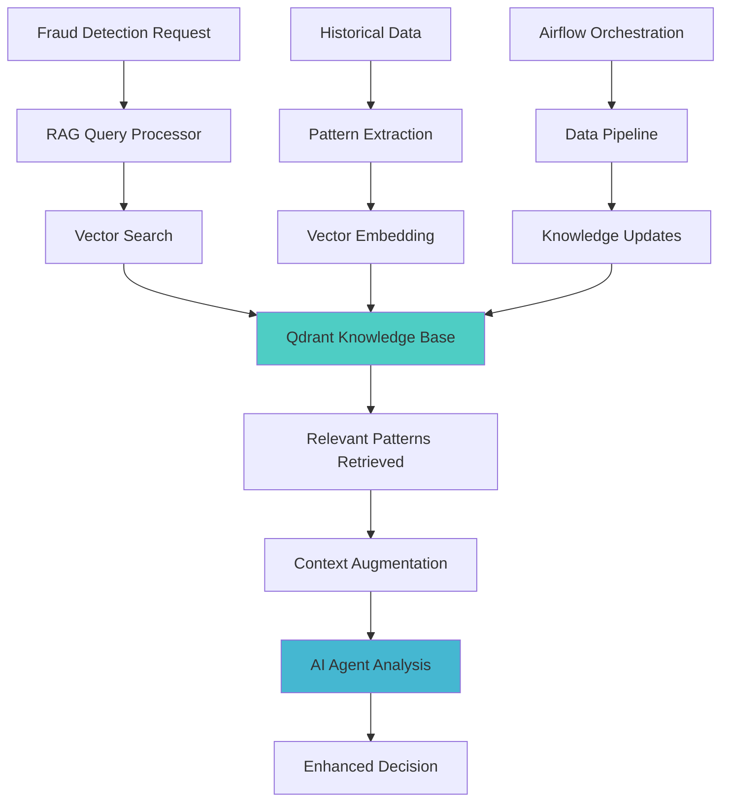

# RAG System - Complete Guide

Retrieval-Augmented Generation system for intelligent fraud pattern recognition and knowledge-based decision support.

## Overview

The RAG (Retrieval-Augmented Generation) system provides intelligent knowledge base capabilities for fraud detection by combining vector search with AI-powered analysis. It integrates with Qdrant vector database and Apache Airflow for orchestration.

## Architecture



## Core Components

### 1. RAG Implementation Files

#### `fraud_rag.py` - Base RAG System
**Core RAG functionality for fraud detection**

```python
from rag.fraud_rag import FraudRAG

rag = FraudRAG()
relevant_patterns = rag.retrieve_patterns(order_data)
```

#### `qdrant_fraud_rag.py` - Vector Database Integration  
**Qdrant-specific RAG implementation**

```python
from rag.qdrant_fraud_rag import QdrantFraudRAG

rag = QdrantFraudRAG()
similar_cases = rag.find_similar_fraud_cases(fraud_signature)
```

### 2. Orchestration System

#### Apache Airflow DAGs

**`fraud_detection_orchestrator.py`** - Main orchestration DAG
```python
# Manages end-to-end fraud detection workflows
- Data ingestion from various sources
- Pattern extraction and vectorization  
- Knowledge base updates
- Model retraining triggers
```

**`qdrant_management_dag.py`** - Vector database management
```python  
# Handles vector database operations
- Collection creation and management
- Vector indexing optimization
- Data cleanup and archival
- Performance monitoring
```

### 3. Knowledge Base Collections

#### Fraud Patterns Collection
- **Purpose**: Store known fraud signatures and patterns
- **Vectors**: Order behavior embeddings
- **Metadata**: Fraud type, severity, success rate
- **Size**: 1536 dimensions (OpenAI embeddings)

#### Customer Profiles Collection  
- **Purpose**: Customer behavior baselines and anomalies
- **Vectors**: Customer activity patterns
- **Metadata**: Account age, transaction history, risk score
- **Updates**: Real-time streaming updates

#### Merchant Analytics Collection
- **Purpose**: Merchant risk profiles and patterns  
- **Vectors**: Merchant behavior embeddings
- **Metadata**: Business type, location, fraud history
- **Refresh**: Daily batch updates

## Configuration

### Qdrant Settings

```python
# In config/settings.py
class QdrantConfig(BaseSettings):
    url: str = Field(default_factory=lambda: os.getenv('QDRANT_URL'))
    api_key: str = Field(default_factory=lambda: os.getenv('QDRANT_API_KEY'))
    collection_name: str = Field(default="fraud_patterns")
    vector_size: int = Field(default=1536)
    distance_metric: str = Field(default="Cosine")
```

### Environment Variables

```bash
# Qdrant Configuration
QDRANT_URL=https://your-cluster.qdrant.io:6333
QDRANT_API_KEY=your-qdrant-api-key
QDRANT_COLLECTION_NAME=fraud_patterns
QDRANT_VECTOR_SIZE=1536
QDRANT_DISTANCE_METRIC=Cosine

# Airflow Configuration  
AIRFLOW_DAGS_FOLDER=./rag/dags
AIRFLOW_DATABASE_URL=sqlite:///./rag/airflow.db
AIRFLOW_EXECUTOR=LocalExecutor

# RAG System Settings
RAG_TOP_K_RESULTS=10
RAG_SIMILARITY_THRESHOLD=0.7
RAG_CONTEXT_WINDOW_SIZE=2000
```

## Usage Examples

### Basic Pattern Retrieval

```python
from rag.qdrant_fraud_rag import QdrantFraudRAG

# Initialize RAG system
rag = QdrantFraudRAG()

# Search for similar fraud patterns
order_data = {
    "user_id": "user_123",
    "total_amount": 299.99,
    "payment_method": "credit_card",
    "merchant": "Restaurant ABC"
}

# Retrieve relevant patterns
patterns = rag.retrieve_patterns(
    order_data, 
    top_k=5, 
    threshold=0.8
)

for pattern in patterns:
    print(f"Pattern: {pattern.metadata['fraud_type']}")
    print(f"Similarity: {pattern.score}")
    print(f"Description: {pattern.payload['description']}")
```

### Agent Integration

```python
from src.agents.crewai_with_prompts import FraudDetectionCrew
from rag.qdrant_fraud_rag import QdrantFraudRAG

# Initialize systems
rag = QdrantFraudRAG()
crew = FraudDetectionCrew()

# Enhanced analysis with RAG context
def analyze_with_context(order_data):
    # Retrieve relevant patterns
    historical_patterns = rag.retrieve_patterns(order_data, top_k=3)
    
    # Add context to agent analysis
    context = {
        "order": order_data,
        "historical_patterns": historical_patterns,
        "analysis_type": "enhanced_rag"
    }
    
    # Run agent analysis with enhanced context
    result = crew.kickoff(context)
    return result
```

### Knowledge Base Updates

```python
from rag.qdrant_fraud_rag import QdrantFraudRAG

rag = QdrantFraudRAG()

# Add new fraud pattern to knowledge base
new_pattern = {
    "order_signature": order_embedding,
    "fraud_type": "account_takeover",
    "severity": "high",
    "detection_method": "velocity_analysis",
    "success_rate": 0.95
}

rag.add_pattern(
    vector=new_pattern["order_signature"],
    metadata=new_pattern
)
```

## Airflow Orchestration

### DAG Configuration

```python
# fraud_detection_orchestrator.py
from airflow import DAG
from airflow.operators.python import PythonOperator
from datetime import datetime, timedelta

default_args = {
    'owner': 'fraud-detection-team',
    'depends_on_past': False,
    'start_date': datetime(2024, 1, 1),
    'email_on_failure': True,
    'email_on_retry': False,
    'retries': 2,
    'retry_delay': timedelta(minutes=5)
}

dag = DAG(
    'fraud_detection_orchestration',
    default_args=default_args,
    description='End-to-end fraud detection workflow',
    schedule_interval=timedelta(hours=6),
    catchup=False
)

# Task definitions
extract_patterns = PythonOperator(
    task_id='extract_fraud_patterns',
    python_callable=extract_patterns_from_database,
    dag=dag
)

update_knowledge_base = PythonOperator(
    task_id='update_qdrant_collections',
    python_callable=update_vector_collections,
    dag=dag
)

# Task dependencies
extract_patterns >> update_knowledge_base
```

### Running Airflow

```bash
# Start Airflow services
cd rag/
astro dev start

# Access Airflow UI
open http://localhost:8080

# Monitor DAG execution
astro dev logs
```

## Performance Optimization

### Vector Search Optimization

```python
# Optimize search parameters
SEARCH_PARAMS = {
    "hnsw_ef": 128,        # Search accuracy vs speed
    "exact": False,        # Use approximate search
    "top_k": 10,          # Limit results
    "threshold": 0.7      # Similarity threshold
}
```

### Caching Strategy

```python
# Redis caching for frequent patterns
from redis import Redis

cache = Redis(host='localhost', port=6379, db=1)

def get_cached_patterns(query_hash):
    cached = cache.get(f"patterns:{query_hash}")
    if cached:
        return json.loads(cached)
    return None

def cache_patterns(query_hash, patterns):
    cache.setex(
        f"patterns:{query_hash}", 
        3600,  # 1 hour TTL
        json.dumps(patterns)
    )
```

### Collection Management

```python
# Optimize collection settings
collection_config = {
    "vectors": {
        "size": 1536,
        "distance": "Cosine",
        "hnsw_config": {
            "m": 16,              # Number of connections
            "ef_construct": 100,  # Construction parameter
            "full_scan_threshold": 10000
        }
    },
    "optimizers_config": {
        "deleted_threshold": 0.2,
        "vacuum_min_vector_number": 1000,
        "default_segment_number": 2
    }
}
```

## Monitoring & Debugging

### Key Metrics

```python
# Monitor these RAG system metrics
- vector_search_latency_ms
- pattern_retrieval_accuracy
- knowledge_base_size_mb
- cache_hit_rate_percentage  
- airflow_dag_success_rate
- qdrant_collection_health
```

### Health Checks

```bash
# Check Qdrant connectivity
curl -X GET "http://localhost:6333/collections"

# Verify collection status
curl -X GET "http://localhost:6333/collections/fraud_patterns"

# Monitor Airflow DAGs
curl -X GET "http://localhost:8080/api/v1/dags"

# Check collection statistics
python -c "from rag.qdrant_fraud_rag import QdrantFraudRAG; rag = QdrantFraudRAG(); print(rag.collection_info())"
```

### Common Issues

| Issue | Symptoms | Solution |
|-------|----------|----------|
| **Slow Vector Search** | High query latency | Optimize HNSW parameters, add indexing |
| **Low Similarity Scores** | Poor pattern matches | Adjust embedding model, retrain vectors |
| **Collection Errors** | Qdrant connection failures | Check API key, verify network connectivity |
| **DAG Failures** | Airflow task errors | Review logs, check dependencies |

## Best Practices

### Vector Quality
1. **Consistent Embeddings**: Use same model for all vectors
2. **Data Preprocessing**: Clean and normalize input data
3. **Regular Updates**: Keep knowledge base current
4. **Quality Metrics**: Monitor retrieval accuracy

### Performance
1. **Batch Operations**: Group vector operations for efficiency
2. **Caching**: Cache frequent queries and results
3. **Index Optimization**: Tune HNSW parameters for workload
4. **Resource Monitoring**: Track memory and CPU usage

### Security
1. **Access Control**: Restrict Qdrant API access
2. **Data Encryption**: Encrypt sensitive pattern data
3. **Audit Logging**: Log all knowledge base access
4. **Backup Strategy**: Regular collection backups

## Troubleshooting

### Vector Search Issues
```bash
# Test vector search manually
python -c "
from rag.qdrant_fraud_rag import QdrantFraudRAG
rag = QdrantFraudRAG()
result = rag.test_connection()
print('Connection:', 'OK' if result else 'FAILED')
"

# Check collection statistics
python -c "
from qdrant_client import QdrantClient
client = QdrantClient(url='your-url', api_key='your-key')
info = client.get_collection('fraud_patterns')
print(f'Vectors: {info.vectors_count}')
"
```

### Airflow Issues
```bash
# Check DAG status
astro dev bash
airflow dags list

# View task logs
airflow tasks log fraud_detection_orchestration extract_patterns 2024-01-01

# Reset failed DAG
airflow dags backfill -s 2024-01-01 -e 2024-01-02 fraud_detection_orchestration
```

## Integration Points

### With Fraud Detection Pipeline
- **Real-time Enhancement**: Streaming integration for live pattern matching
- **Batch Processing**: Offline analysis with historical context
- **Agent Augmentation**: Enhanced AI agent decision-making

### With Monitoring Systems
- **Metrics Collection**: RAG performance metrics
- **Alerting**: Pattern quality degradation alerts
- **Dashboards**: Knowledge base health visualization

## Related Documentation

- [AI Agents System](../agents/complete-guide.md): Agent integration with RAG
- [Streaming System](../streaming/complete-guide.md): Real-time RAG integration
- [Configuration Guide](../installation.md): Environment setup
- [Dashboard Components](../components/dashboard.md): RAG metrics visualization