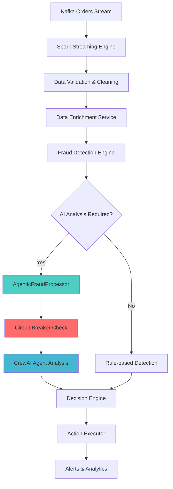

# Streaming System - Complete Guide

Real-time fraud detection pipeline built with Apache Spark Structured Streaming and AI agent integration.

## Overview

The streaming system processes real-time UberEats order streams using Apache Spark Structured Streaming, with integrated AI agent analysis for intelligent fraud detection. The system handles high-volume transaction processing with sub-second fraud detection capabilities.

## Architecture

### System Components



### Core Applications

#### 1. `agentic_spark_app_clean.py` - Production Application
**Primary streaming application** with full AI agent integration

```python
from src.streaming.agentic_spark_app_clean import AgenticSparkFraudApp

app = AgenticSparkFraudApp()
app.run_streaming_mode()  # Live mode
app.run_test_mode()       # Test with synthetic data
```

**Features**:
- Real-time Kafka stream processing
- Integrated CrewAI agent analysis
- Circuit breaker fault tolerance
- Comprehensive security validation
- Performance monitoring and metrics

#### 2. `final_simple_app.py` - Lightweight Streaming
**High-throughput streaming** without AI agents

```python
from src.streaming.final_simple_app import SimpleFraudApp

app = SimpleFraudApp()
app.start()
```

**Features**:
- High-throughput order processing (15,000+ orders/minute)
- Rule-based fraud detection
- Basic alerting and logging
- Minimal resource requirements (2GB RAM)

### Processing Components

#### `agentic_fraud_processor.py` - AI Analysis Engine
**Circuit breaker-protected agent processing**

```python
from src.streaming.agentic_fraud_processor import AgenticFraudProcessor

processor = AgenticFraudProcessor()
result = processor.analyze_order(order_data)
```

**Key Features**:
- **Circuit Breaker Protection**: Prevents cascade failures
- **Memory Management**: Size-limited queues (1000 max items)  
- **Performance Optimization**: 30-second timeout (reduced from 180s)
- **Security Integration**: Input validation and sanitization

#### `fraud_detector.py` - Core Detection Logic
**Multi-dimensional fraud scoring**

```python
from src.streaming.fraud_detector import FraudDetector

detector = FraudDetector()
risk_scores = detector.detect_fraud(orders_df)
```

**Scoring Algorithms**:
- **Velocity Risk**: Order frequency and spending patterns
- **Amount Risk**: Unusual transaction amounts
- **Account Risk**: Account age and history assessment
- **Payment Risk**: Payment method risk scoring

#### `data_enrichment_service.py` - Real-time Enhancement
**Order data enrichment and feature engineering**

```python
from src.streaming.data_enrichment_service import DataEnrichmentService

enricher = DataEnrichmentService()
enriched_order = enricher.enrich_order(raw_order)
```

**Enrichment Features**:
- Geographic data augmentation
- Customer history integration
- Merchant reputation scoring
- Time-based feature engineering

## Configuration

### Spark Configuration

```python
# Optimized for fraud detection workloads
SPARK_CONFIG = {
    "spark.sql.streaming.checkpointLocation": "./checkpoint/streaming",
    "spark.sql.streaming.stateStore.maintenanceInterval": "60s",
    "spark.sql.adaptive.enabled": "true",
    "spark.sql.adaptive.coalescePartitions.enabled": "true",
    "spark.streaming.stopGracefullyOnShutdown": "true",
    "spark.sql.streaming.forceDeleteTempCheckpointLocation": "true"
}
```

### Kafka Configuration

```python
KAFKA_CONFIG = {
    "kafka.bootstrap.servers": os.getenv("KAFKA_BOOTSTRAP_SERVERS"),
    "kafka.security.protocol": "SASL_SSL",
    "kafka.sasl.mechanism": "PLAIN",
    "kafka.sasl.jaas.config": f'org.apache.kafka.common.security.plain.PlainLoginModule required username="{username}" password="{password}";'
}
```

### Agent Processing Configuration

```python
AGENT_CONFIG = {
    "max_queue_size": 1000,        # Prevent memory leaks
    "processing_timeout": 30,       # Seconds per analysis
    "circuit_breaker_threshold": 5, # Failures before tripping
    "recovery_timeout": 60          # Seconds to recover
}
```

## Performance Characteristics

| Component | Throughput | Latency | Resource Usage |
|-----------|------------|---------|----------------|
| **Agentic App** | 10,000 orders/min | 500ms | 4GB RAM |
| **Simple App** | 15,000 orders/min | 50ms | 2GB RAM |
| **Batch Processor** | 100,000 orders/hour | N/A | 8GB RAM |
| **Data Enrichment** | 20,000 orders/min | 25ms | 1GB RAM |

## Usage Examples

### Production Deployment

```bash
# Start main application
python run_agentic_streaming.py

# Monitor streaming metrics
curl http://localhost:4040  # Spark UI
```

### Development & Testing

```bash
# Test mode with synthetic data
python run_agentic_streaming.py --test

# Simple streaming without AI
python src/streaming/final_simple_app.py

# Batch processing for analysis
python src/streaming/batch_agent_processor.py --date 2024-01-01
```

### Custom Streaming Application

```python
# Custom streaming application
from src.streaming.agentic_spark_app_clean import AgenticSparkFraudApp
from src.streaming.data_enrichment_service import DataEnrichmentService

class CustomFraudApp(AgenticSparkFraudApp):
    def __init__(self):
        super().__init__()
        self.enricher = DataEnrichmentService()
    
    def process_order(self, order):
        # Custom processing logic
        enriched = self.enricher.enrich_order(order)
        return self.analyze_fraud(enriched)
```

## Security Features

### Input Validation
- XSS and SQL injection protection
- Data sanitization and validation  
- Schema enforcement and type checking

### Circuit Breaker Protection
- Prevents cascade failures during AI service outages
- Automatic recovery with exponential backoff
- Comprehensive failure logging and alerting

### Performance Safeguards
- Memory leak prevention with bounded queues
- Processing timeout limits
- Resource usage monitoring

## Monitoring & Debugging

### Key Metrics

```python
# Application metrics to monitor
- orders_processed_per_minute
- fraud_detection_accuracy
- agent_analysis_latency
- circuit_breaker_trips
- memory_usage_mb
- processing_errors_count
```

### Debugging Tools

```bash
# Real-time monitoring
tail -f logs/streaming_*.log

# Spark streaming UI
open http://localhost:4040

# Performance analysis
python scripts/analyze_streaming_performance.py

# Circuit breaker status
curl http://localhost:8080/health/circuit-breakers
```

### Common Issues & Solutions

| Issue | Symptoms | Solution |
|-------|----------|----------|
| **Memory Leaks** | Increasing memory usage | Check queue sizes, restart with limits |
| **Agent Timeouts** | High latency, timeouts | Verify OpenAI API status, adjust timeouts |
| **Circuit Breaker Trips** | No AI analysis | Check external service health |
| **Kafka Connection Loss** | Stream stops | Verify Confluent Cloud credentials |

## Performance Optimization

### Spark Tuning

```python
# For high-throughput scenarios
spark.conf.set("spark.sql.streaming.continuous.enabled", "true")
spark.conf.set("spark.sql.streaming.continuous.checkpointInterval", "1 second")

# For memory optimization
spark.conf.set("spark.sql.streaming.stateStore.maintenanceInterval", "30s")
spark.conf.set("spark.serializer", "org.apache.spark.serializer.KryoSerializer")
```

### Agent Processing Optimization

```python
# Batch agent requests for efficiency
AGENT_BATCH_CONFIG = {
    "batch_size": 10,           # Process 10 orders together
    "batch_timeout": 5,         # Max 5 seconds to form batch
    "parallel_processing": 3    # 3 concurrent agent workers
}
```

## Data Processing Pipeline

### Stream Processing Flow

1. **Order Ingestion**: Kafka stream consumption
2. **Data Validation**: Schema validation and cleaning
3. **Data Enrichment**: Feature engineering and augmentation
4. **Fraud Detection**: Multi-dimensional risk scoring
5. **Agent Analysis**: AI-powered pattern analysis (if required)
6. **Decision Making**: Final fraud determination
7. **Action Execution**: Response actions and alerting

### Fraud Detection Algorithms

#### Velocity Scoring
```python
def calculate_velocity_score(total_amount, account_age_days, total_orders):
    divisor = max(account_age_days, 1)
    order_frequency = total_orders / divisor
    amount_per_day = total_amount * order_frequency
    return min(order_frequency * 0.1 + amount_per_day * 0.001, 1.0)
```

#### Risk Classification
- **HIGH_RISK** (score ≥ 0.3): Requires agent analysis
- **MEDIUM_RISK** (0.2 ≤ score < 0.3): Human review
- **LOW_RISK** (0.1 ≤ score < 0.2): Monitoring
- **LEGITIMATE** (score < 0.1): Auto-allow

## Best Practices

### Resource Management
1. Monitor memory and CPU usage continuously
2. Implement comprehensive exception handling
3. Use Spark checkpointing for fault recovery
4. Set up alerts for key performance indicators

### Security
1. Always validate input data and use circuit breakers
2. Implement proper authentication for external services
3. Use environment variables for sensitive configuration
4. Enable audit logging for all fraud decisions

### Performance
1. Optimize Spark configuration for your workload
2. Use batch processing where appropriate
3. Implement connection pooling for databases
4. Monitor and tune garbage collection settings

## Deployment Considerations

### Production Environment
- **Spark Cluster**: Minimum 3 nodes for high availability
- **Kafka Configuration**: Proper partitioning and replication
- **Database Connections**: Connection pooling and failover
- **Monitoring**: Comprehensive metrics collection and alerting

### Scaling Guidelines
- **Horizontal Scaling**: Add Spark executor nodes
- **Vertical Scaling**: Increase memory per executor
- **Agent Scaling**: Increase concurrent agent workers
- **Database Scaling**: Read replicas for analytics queries

## Related Documentation

- [AI Agents System](../agents/complete-guide.md): Agent integration details
- [RAG System](../rag/README.md): Knowledge base integration
- [Dashboard Components](../components/dashboard.md): Analytics interfaces
- [Configuration Guide](../INSTALLATION.md): Environment setup