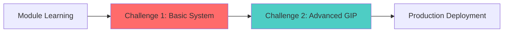
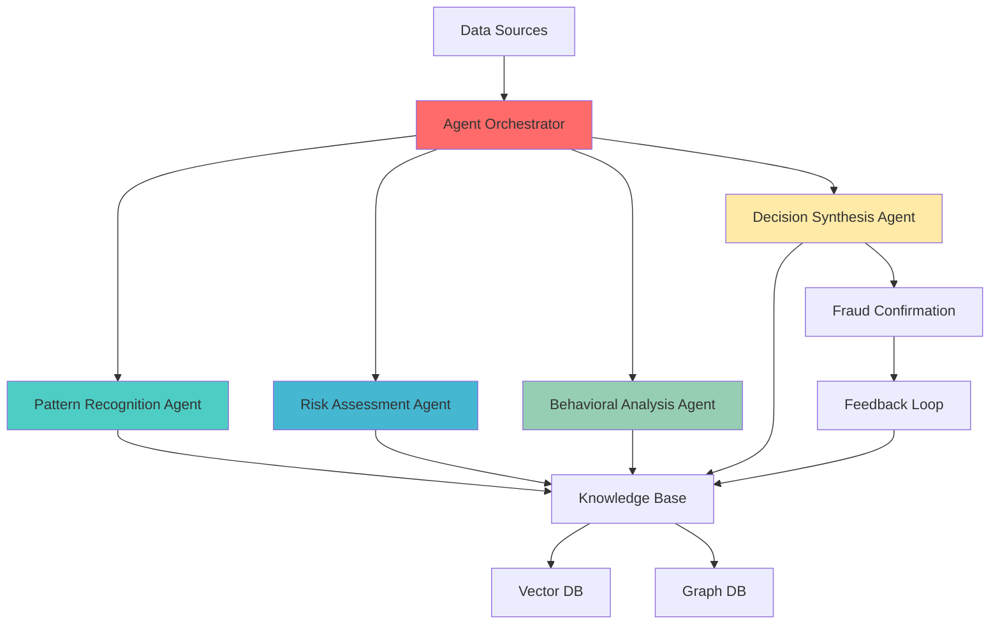

# 🎯 AI Data Engineer Bootcamp - Challenges & Tasks

> **Master real-world AI engineering through hands-on challenges that test your ability to build production-ready fraud detection systems**

## 📋 Table of Contents
- [Overview](#overview)
- [Challenge Structure](#challenge-structure)
- [Prerequisites](#prerequisites)
- [Challenge 1: Fraud Detection System](#challenge-1-fraud-detection-system)
- [Challenge 2: GenAI Intelligent Pipeline (GIP)](#challenge-2-genai-intelligent-pipeline-gip)
- [How Challenges Connect to Modules](#how-challenges-connect-to-modules)
- [Getting Started](#getting-started)
- [Evaluation Framework](#evaluation-framework)
- [Support & Resources](#support--resources)

## 🎯 Overview

This tasks folder contains two progressive challenges designed to test and enhance your skills as an AI Data Engineer. These challenges simulate real-world scenarios where you'll build sophisticated fraud detection systems for UberEats, leveraging the knowledge and technologies covered throughout the bootcamp modules.

### Key Learning Outcomes
- **Production Systems**: Build enterprise-grade systems from scratch
- **Problem Solving**: Debug and fix deliberate issues in complex codebases
- **AI Integration**: Implement multi-agent AI systems with LLMs
- **Real-time Processing**: Master streaming architectures with Spark and Kafka
- **Engineering Excellence**: Apply best practices for security, monitoring, and scalability

## 🏗️ Challenge Structure

### Challenge Progression Path


### Difficulty Levels
| Challenge | Duration | Difficulty | Focus Area |
|-----------|----------|------------|------------|
| **Challenge 1** | 2-3 days | Senior Engineer | System Reconstruction & Debugging |
| **Challenge 2** | 15-25 days | Senior AI/ML Engineer | GenAI Multi-Agent Systems |

## 📚 Prerequisites

### Technical Requirements
- **Python**: 3.10+ with advanced proficiency
- **Docker**: Container orchestration experience
- **Cloud Services**: Trial accounts or local alternatives
- **Version Control**: Git and GitHub proficiency
- **AI Tools**: Access to LLM APIs (OpenAI, Anthropic, etc.)

### Knowledge Requirements
- Completed Modules 1-5 of the bootcamp
- Understanding of streaming architectures
- Familiarity with ML/AI concepts
- Experience with distributed systems

## 🛡️ Challenge 1: Fraud Detection System

### Mission Statement
Reconstruct and fix a partially broken fraud detection system for UberEats, identifying and resolving deliberately introduced issues while building a production-ready pipeline.

### Core Components to Build
```
Kafka Stream → Spark Processing → Fraud Detection → AI Analysis → Decision Engine
                     ↓                    ↓              ↓
                Data Enrichment      Risk Scoring    Vector DB
                     ↓                    ↓              ↓
                 PostgreSQL          Monitoring     Actions
```

### Key Technologies
- **Apache Spark 4.0+**: Real-time stream processing
- **Kafka/Confluent Cloud**: Message streaming
- **OpenAI GPT-4**: Intelligent fraud analysis
- **Qdrant/ChromaDB**: Vector similarity search
- **Redis**: High-performance caching
- **PostgreSQL**: Results persistence

### Learning Objectives
- Debug complex distributed systems
- Implement security best practices
- Optimize performance for production
- Create comprehensive documentation
- Build resilient error handling

### Success Metrics
- ✅ Process 100+ test orders successfully
- ✅ Achieve >85% fraud detection accuracy
- ✅ End-to-end processing <10 seconds
- ✅ Zero critical security vulnerabilities
- ✅ All services properly integrated

## 🧠 Challenge 2: GenAI Intelligent Pipeline (GIP)

### Mission Statement
Design and build a next-generation fraud detection system using multiple specialized AI agents that collaborate to identify fraud patterns, provide explanations, and continuously improve through feedback loops.

### Multi-Agent Architecture


### Specialized AI Agents

#### 🔍 Pattern Recognition Agent
- **Domain**: Historical fraud pattern identification
- **Skills**: Anomaly detection, pattern clustering, signature matching
- **Integration**: Vector similarity search with Qdrant

#### ⚖️ Risk Assessment Agent
- **Domain**: Multi-dimensional risk scoring
- **Skills**: Probability calculation, risk factor analysis, threshold optimization
- **Integration**: Statistical models and ML scoring

#### 🧠 Behavioral Analysis Agent
- **Domain**: User psychology and behavior anomalies
- **Skills**: Journey analysis, account takeover detection, social engineering identification
- **Integration**: Graph database relationships

#### 🎯 Decision Synthesis Agent
- **Domain**: Strategic decision making and evidence synthesis
- **Skills**: Evidence aggregation, explainable AI, action triggering
- **Integration**: Langfuse prompt management

### Advanced Features
- **Continuous Learning**: Self-improving knowledge base
- **Prompt Engineering**: Advanced LLM optimization with Langfuse
- **Real-time Processing**: Sub-500ms fraud detection
- **Explainable AI**: Clear reasoning for all decisions
- **Enterprise Scale**: 10,000+ orders/minute capacity

### Success Metrics
- ✅ 4 fully functional AI agents
- ✅ <1 second detection latency
- ✅ >90% precision, >85% recall
- ✅ Working feedback loop
- ✅ Production-ready deployment

## 🔗 How Challenges Connect to Modules

### Module Integration Map

| Module | Topic | Challenge 1 Application | Challenge 2 Application |
|--------|-------|------------------------|------------------------|
| **Module 1** | Document Intelligence | Invoice processing for fraud patterns | Knowledge base document extraction |
| **Module 2** | RAG & Agents | Basic agent for fraud analysis | Multi-agent orchestration system |
| **Module 3** | Text-to-SQL | Query fraud history database | Natural language fraud queries |
| **Module 4** | Multi-Agent Systems | Simple agent coordination | Advanced CrewAI implementation |
| **Module 5** | Fraud Detection | Core system implementation | Enhanced with GenAI pipeline |

### Progressive Skill Building
```
Module Learning → Challenge 1 (Apply & Debug) → Challenge 2 (Innovate & Scale)
```

### Technology Stack Alignment
Both challenges use the same core technologies covered in the modules:
- Stream processing (Spark, Kafka)
- AI/ML integration (OpenAI, LangChain, CrewAI)
- Vector databases (Qdrant, ChromaDB)
- Orchestration patterns (Airflow concepts)
- Production practices (Docker, monitoring, security)

## 🚀 Getting Started

### Step 1: Environment Setup
```bash
# Create private GitHub repository
git clone <bootcamp-repo>
cd ai-data-engineer-bootcamp

# Review module implementations
cd src/mod-5-fraud-detection
./scripts/validate_connections.py

# Setup challenge workspace
mkdir -p ~/fraud-detection-challenge
cd ~/fraud-detection-challenge
```

### Step 2: Choose Your Path

#### For Challenge 1 (2-3 days):
```bash
# Copy base fraud detection system
cp -r src/mod-5-fraud-detection/* .

# Run initial health check
python scripts/validate_connections.py

# Document issues found
echo "# Issue Log" > docs/issue-log.md

# Start systematic debugging
python run_agentic_streaming.py --test
```

#### For Challenge 2 (15-25 days):
```bash
# Create GIP project structure
mkdir -p gip-fraud-detection/{src,docs,tests,config}

# Setup agent framework
pip install crewai langfuse qdrant-client

# Initialize knowledge base
python scripts/setup_knowledge_base.py

# Start agent development
python src/agents/base_agent.py
```

### Step 3: Development Workflow

#### Daily Routine
1. **Morning**: Review objectives and plan tasks
2. **Development**: Implement features with AI assistance
3. **Testing**: Validate changes with comprehensive tests
4. **Documentation**: Update technical docs and issue logs
5. **Commit**: Version control with meaningful messages

#### Recommended Tools
- **Claude Code**: Code review and optimization
- **GitHub Copilot**: Intelligent code completion
- **ChatGPT/Claude**: Research and problem-solving
- **Langfuse**: Prompt engineering and monitoring

## 📊 Evaluation Framework

### Technical Excellence (40%)
- Code quality and architecture
- Problem-solving approach
- System integration
- Performance optimization

### Engineering Practices (30%)
- Documentation completeness
- Testing coverage
- Security implementation
- Best practices adherence

### Innovation & Impact (20%)
- Creative solutions
- Advanced features
- Scalability considerations
- User experience

### Delivery & Communication (10%)
- Project management
- Progress tracking
- Professional presentation
- Resource utilization

## 📞 Support & Resources

### Documentation Hub
- **Module Docs**: `/src/mod-*/docs/` - Technical guides for each module
- **Challenge Specs**: `/tasks/` - Detailed challenge requirements
- **API Docs**: Links to external service documentation
- **Best Practices**: Engineering standards and patterns

### Learning Resources

#### Streaming & Processing
- [Apache Spark Documentation](https://spark.apache.org/docs/latest/)
- [Kafka Streams Guide](https://kafka.apache.org/documentation/streams/)
- [Real-time Processing Patterns](https://www.confluent.io/learn/stream-processing/)

#### AI & Machine Learning
- [OpenAI API Reference](https://platform.openai.com/docs)
- [LangChain Documentation](https://python.langchain.com/docs/)
- [CrewAI Framework](https://github.com/joaomdmoura/crewAI)
- [Langfuse Observability](https://langfuse.com/docs)

#### Vector & Graph Databases
- [Qdrant Documentation](https://qdrant.tech/documentation/)
- [ChromaDB Guide](https://docs.trychroma.com/)
- [Neo4j Graph Database](https://neo4j.com/docs/)

#### Cloud Services (Trial Versions)
- [Confluent Cloud](https://www.confluent.io/confluent-cloud/tryfree/)
- [Qdrant Cloud](https://cloud.qdrant.io/)
- [OpenAI Platform](https://platform.openai.com/)

### Getting Help

#### Debugging Strategy
1. **Isolate**: Identify the specific component failing
2. **Research**: Check documentation and error messages
3. **AI Assist**: Use Claude/ChatGPT for guidance
4. **Test**: Verify fixes in isolation
5. **Integrate**: Apply solution to full system

#### Common Issues & Solutions
- **Connection Errors**: Check environment variables and service availability
- **Memory Issues**: Optimize Spark configurations and batch sizes
- **API Limits**: Implement rate limiting and retry logic
- **Data Inconsistencies**: Validate schemas and transformations

### Pro Tips

#### For Success
- ✅ Start early - setup takes time
- ✅ Document everything - maintain detailed logs
- ✅ Test frequently - catch issues early
- ✅ Use AI tools - they're explicitly encouraged
- ✅ Version control - commit progress regularly

#### To Avoid
- ❌ Skipping documentation
- ❌ Hardcoding credentials
- ❌ Ignoring error handling
- ❌ Over-engineering solutions
- ❌ Working in isolation

## 🎓 Learning Outcomes

Upon completing these challenges, you will have:

### Technical Mastery
- Built production-ready fraud detection systems
- Implemented multi-agent AI architectures
- Optimized real-time data pipelines
- Secured and monitored distributed systems

### Professional Skills
- Debugged complex enterprise systems
- Designed scalable AI solutions
- Created comprehensive documentation
- Demonstrated engineering excellence

### Portfolio Assets
- Two complete fraud detection implementations
- Documented architecture decisions
- Performance optimization case studies
- Production deployment guides

---

## 🚀 Ready to Begin?

Choose your challenge and start building! Remember:
- **Challenge 1** tests your debugging and system integration skills
- **Challenge 2** pushes the boundaries of AI-powered engineering
- Both challenges prepare you for real-world AI data engineering roles

**Good luck, and may your pipelines flow smoothly! 🎯**

---

*Last Updated: 2024*  
*Bootcamp Version: 1.0*  
*Contributors: AI Data Engineering Team*